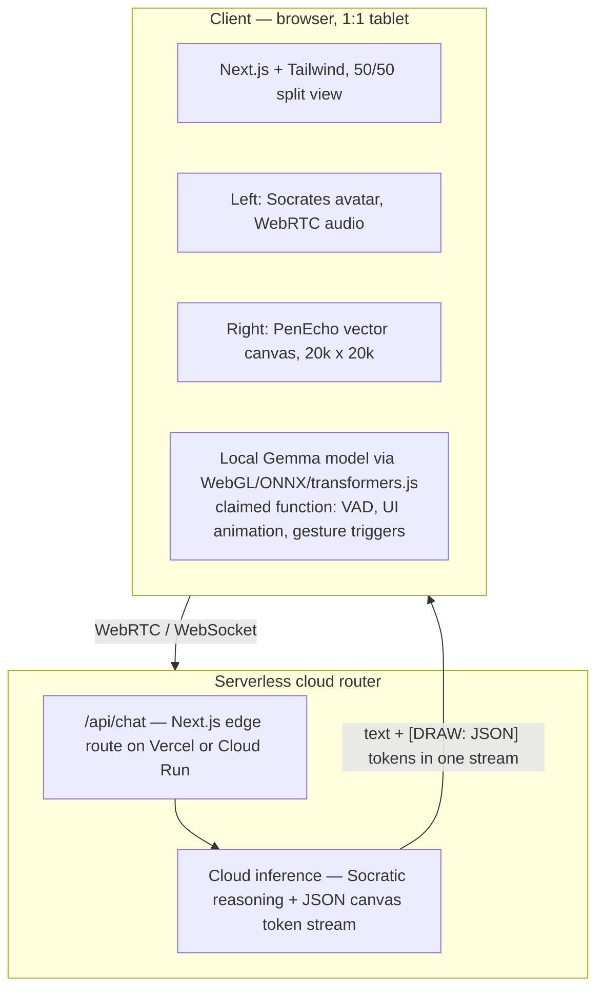

# Source of Truth — Reconciled Baseline

> **How to use this document.** This is the only place where "what True Learn AI is"
> is defined. Every downstream document (PRD, TAR, HLD, ADRs) cites this file rather
> than the deck, the blueprint, or the website. Where the three sources disagree, this
> file records the disagreement as a numbered contradiction (`C-nnn`) and does **not**
> silently pick a winner. Where we must proceed without an answer, the gap is recorded
> as a numbered assumption (`A-nnn`) that downstream docs cite by ID, so we can trace
> what breaks when one turns out to be wrong.

---

## 1. Source inventory and provenance

| ID | Source | Version / date | Authority | Notes |
|----|--------|----------------|-----------|-------|
| S1 | `True Learn AI Pitch Deck-3.pdf` — seed pitch deck | "Seed Pitch Deck · 2026", 14 slides | Founder-authored. Commercial + market claims. | Content ingested via conversation attachment. |
| S2 | `True learn AI structure.pdf` — "Technical & Pedagogical Blueprint / Developer PRD" | "Version 2.0 (Master Execution Draft)", 12 pages | Founder-authored. Technical + pedagogical intent. | Content ingested via conversation attachment. |
| S3 | `https://akash200409.github.io/True-learn.ai/` | Self-labelled "VERSION 4.0", "Socratic Engine v4", "PenEcho Spatial Lightboard v2.4", footer © 2026 | Public-facing marketing site. **Live to the internet.** | Retrieved 2026-09-07. Hosted on GitHub Pages under a personal account; footer links to `truelearn.ai`. |

### 1.1 Provenance defect (fix before Discovery)

**The `inputs/` directory in this repository is empty.** S1 and S2 reached this engagement
as conversation attachments, not as version-controlled files. Nothing in this repo can be
independently re-derived from source. Before the Discovery gate:

- [ ] Commit the two PDFs to `inputs/` with their SHA-256 hashes recorded here.
- [ ] Commit a dated HTML snapshot of S3 to `inputs/` — it is a live site under a
      third party's personal GitHub account and can change or vanish without notice,
      and several claims on it are ones we are about to ask the founders to retract
      (see `C-001`). We need the "as found" state on the record.

**A-000** — this document is written against the source content as ingested on
2026-09-07. If the committed PDFs differ from what was ingested, this document is void
and must be rebuilt.

---

## 2. Reconciled factual baseline

Statements in this section are consistent across all sources that address them, or are
uncontradicted single-source statements marked as such. **Consistency across three
founder-authored documents is not evidence of truth** — it means only that the founders
believe it. Truth claims are assessed separately in
[`01-claims-audit.md`](01-claims-audit.md).

### 2.1 Product identity

True Learn AI is an after-school, institutionally-sold, voice-first Socratic tutoring
companion for K-12 STEM. It is positioned explicitly *against* answer-giving LLMs: the
central product promise is that it **refuses to output direct solutions** and instead
drives students through first-principles questioning, with a synchronized visual
explanation surface. It is sold to schools as a supplement to — not a replacement for —
the existing curriculum and the classroom teacher. All three sources agree on this
positioning, and it is the most coherent part of the company.

### 2.2 The four pedagogical mechanisms (S2 is authoritative)

1. **Axiomatic Deconstruction** — reduce a homework problem to ground-truth physical,
   mathematical or logical axioms.
2. **Socratic Step-Down Scaffolding** — on student hesitation or "I don't know", drop one
   abstraction layer and present a concrete real-world analogy on the canvas rather than
   continuing to interrogate at the same level. *(S2's worked example: Newton's Third Law
   → two 60 kg ice skaters on frictionless ice.)*
3. **Feynman Reverse-Teaching Loop** — the student teaches the concept back; Socrates
   plays the naive pupil; mastery is logged only when the student defends the concept
   from axioms without gaps.
4. **Teacher-in-the-Loop Escalation** — after "3-4 consecutive Socratic failures", generate
   a micro-summary of the conceptual block and push it to a teacher analytics dashboard.

Step-Down (2) is the genuinely differentiated idea in this product and the thing most
worth protecting. It is also the least specified: no source defines what triggers it, how
far down the ladder it can go, or what happens at the bottom.

### 2.3 Users and buyers

| Role | Relationship to product | Source coverage |
|------|------------------------|-----------------|
| Student (K-12, STEM) | Primary user; voice + stylus; after-school/homework context | All sources |
| Classroom teacher | Recipient of escalations and cohort analytics | S1, S2, S3 |
| School management / chain owner | **Economic buyer** for the B2B motion | S1, S3 |
| Parent | Payer in the B2C tier; consent-giver for a minor | **Not addressed in any source** — see §5 |
| School IT / admin | Deployment, rostering, SSO, device management | **Not addressed in any source** — see §5 |

### 2.4 Intended architecture (S2, corroborated in outline by S1 and S3)

Agreed elements across sources:

- **Split-screen UI**: avatar left, infinite vector canvas right, control deck below.
- **Canvas**: 20,000 × 20,000 logical pixels; declarative draw primitives streamed in
  time with speech; stylus/touch input; 512 × 512 WebP sparse tile cropping for vision input.
- **Voice**: WebRTC audio out, VAD-driven barge-in that halts both audio playback *and*
  the canvas drawing stream.
- **Hybrid edge/cloud split**: a small local model in the browser for latency-critical
  UI work, a large cloud model for reasoning.
- **Wire protocol**: the cloud model emits `[DRAW: {json}]` tokens inline in its text
  stream; a client-side regex parser extracts them, appends to canvas state, and strips
  them from the visible transcript. S2 ships reference code for this at
  `/lib/stream-parser.ts`.

### 2.5 Design system (S2)

Dark mode. Background `#090A0F`, text `#E5E7EB`, accents `#38BDF8` (cyan) and `#D4AF37`
(gold). "Digital Renaissance / Neoclassical Tech". S3 executes a variant of this.
Note that S1 (the deck) uses an entirely different, light palette with yellow accents.
Brand is not yet a single system; low priority, but it will matter for school-facing
collateral.

### 2.6 Commercial model

| Channel | Price | Source |
|---------|-------|--------|
| B2B institutional | $30–$50 per student per year | S1 slide 10, S3 |
| B2C direct | $15–$25 per month | S1 slide 10 only — **absent from S3** |

Both sources claim a "98% cost advantage" from the hybrid stack. Use of funds (S1): 60%
R&D/compute, 25% institutional pilots (GCC & India), 15% operations & data compliance.

> **Observation, not a contradiction:** B2C at $15–25/month is $180–300/year against a
> B2B seat at $30–50/year — a 4–10× differential between channels for the same product.
> That is a channel-conflict and arbitrage problem (a school-adjacent parent buys the
> cheaper seat), and it is also a signal that the B2B price is set too low, the B2C price
> too high, or the two were derived independently without reconciliation. Flagged for the
> PRD/GTM gate.

### 2.7 Team

| | S1 (deck) | S3 (site) |
|---|---|---|
| **Aakash Dyavanapally** | CEO. Woxsen BBA '22. "Works at Manasa Constructions", family business serving school chains in Telangana & Andhra Pradesh. Executive relationships with school management. | Founder & CEO. "Global strategy, ADGM setup, Hub71 acceleration, First-Principles curriculum scaffolding, partnerships, capital strategy, investor relations." "Committing to relocation to Abu Dhabi." |
| **Pranav Chaitanya Varma** | COO. Woxsen B.Tech '22. "Works at Chipsolve Technologies", AI chip design. Claimed expertise: GPU edge optimization, sub-second WebRTC audio streams, low-latency inference architecture. | Founder & COO. "Operational execution, core tech backend architecture, institutional school network, Socratic guardrail design, regional expansion strategy." |

See `C-002` and `C-003`. Both descriptions use the present tense "works at" — neither
source states either founder is full-time on True Learn AI.

### 2.8 Current build state

**S2's own deliverable checklist is entirely unchecked.** All five items — repo compiling
on localhost, `.env.local` with an API key, canvas rendering from `[DRAW:]` chunks, system
prompt enforcing zero direct answers, WebRTC barge-in, deployed URL — are open. S2
describes a four-phase build that has not started.

The only artefact that demonstrably exists is S3: a static marketing site with a scripted,
non-functional "sandbox" demo. There is no evidence in any source of a working product,
a paying school, a signed LOI, or a completed pilot.

**This is the correct and expected state for a pre-seed company and is not itself a
problem.** The problem is `C-001`.

### 2.9 Jurisdiction and entity (S3 only)

Corporate HQ intended in Abu Dhabi, UAE, via ADGM, associated with Hub71 / "Hub71+ AI".
R&D centre in India, explicitly framed as a cost-and-talent arbitrage. S1 and S2 are
silent on entity, jurisdiction and data residency.

---

## 3. Contradiction register

Ordered by how much damage each one does if left unresolved.

| ID | Subject | Severity | Status |
|----|---------|----------|--------|
| C-001 | Deployment status: site claims live, blueprint says unbuilt | **Critical** | Open — founder decision required this week |
| C-002 | COO's role and technical scope | High | Open |
| C-003 | Founder availability / full-time status | High | Open |
| C-004 | Geographic strategy: India as market vs India as cost centre | High | Open |
| C-005 | Product version numbering: v2.0 vs v4.0 | Medium | Open |
| C-006 | Latency specification: "sub-second" vs "<450ms VAD" | Medium | Open |
| C-007 | B2C channel exists or doesn't | Medium | Open |
| C-008 | Named model stack differs between sources and may not exist | High | See claims audit |
| C-009 | "ACV" used to mean per-seat price | Low | Open |

---

### C-001 — The website claims a deployed system that the blueprint says has not been built

**Severity: Critical. This is the single most dangerous item in the entire source set.**

S3 states, in the persistent header of a publicly-accessible website:

> "HUB71+ AI VERSION 4.0 // HUB71+ UAE DEPLOYED SOCRATIC ENGINE v4"

and presents four architecture pillars each carrying a live-status indicator:

- `AUDIO FEED: STREAMING_ACTIVE`
- `CANVAS FEED: PENECHO_SYNC`
- `TEACHER COHORT FEED: CONNECTED`
- `GEOGRAPHIC ARBITRAGE: DEPLOYED`

and a specific operational metric:

- `"Grade 9: Capillary action block | 84% Cohort coverage"`

A reader's only available interpretation is that a system is running, in the UAE,
with real Grade 9 students, producing real cohort analytics. S2's unchecked deliverable
checklist says otherwise, and no source provides a school, a cohort size, a date, or a
denominator for the 84%.

**Why this matters more than a marketing overstatement.** These claims are made to
prospective investors and prospective school buyers about a product that processes
children's data. If an investor wires money having read "DEPLOYED" and "84% cohort
coverage", the gap between that and reality is not a positioning problem — it is a
misrepresentation problem that survives into the diligence file, the data room, and
potentially the subscription agreement's representations and warranties.

**Recommended action — this week, before any further outbound:**
1. Snapshot the current site to `inputs/` for the record.
2. Replace every status indicator with an honest label. `DESIGN TARGET`, `IN
   DEVELOPMENT`, `PLANNED` are all fine. Investors fund pre-product companies constantly;
   they do not fund founders whose claims don't survive a five-minute check.
3. Remove `84% Cohort coverage` entirely, or relabel the whole panel `ILLUSTRATIVE — NOT
   REAL DATA` in text a reader cannot miss.
4. Determine and state the *actual* Hub71 relationship — applied, accepted, in a cohort,
   or aspirational — and use the precise word. See `A-011`.

**Open question O-01.** Has this site been sent to any investor, school, or accelerator?
If yes, to whom and when? That determines whether this is an edit or a correction notice.

---

### C-002 — The COO is two different people across the two sources

S1 describes a hardware/infrastructure specialist: "AI chip design", "GPU edge
optimization, sub-second WebRTC audio streams, and low-latency inference architecture".
S3 describes a generalist operator: "operational execution, core tech backend
architecture, institutional school network, Socratic guardrail design, and regional
expansion strategy".

These are not the same job, and the discrepancy points at a real staffing question rather
than a copy-editing one. Neither description evidences experience *shipping and operating
production real-time media software*, which is the actual hard part of this product
(see `02-engagement-plan.md` §4). AI chip design and WebRTC media engineering are
unrelated disciplines that share the word "latency".

**Open question O-02.** What has the COO personally built and shipped? Specifically: has
he ever operated a WebRTC application in production, and if so, at what concurrency?
This is not a challenge to his competence — it determines whether the real-time media
layer is a build or a buy, which is the most expensive early decision in the plan.

---

### C-003 — Neither founder is stated to be full-time

S1 says the CEO "works at Manasa Constructions" and the COO "works at Chipsolve
Technologies", both present tense. S3 says the CEO is "committing to relocation to Abu
Dhabi" — a future commitment, not a current state.

**Open question O-03.** Are both founders full-time as of today? If not, on what date,
and what triggers it? Every schedule in `06-implementation/` depends on the answer, and
so does the credibility of the fundraise.

---

### C-004 — India is the primary market in one source and a cost centre in the other

S1's SOM is "1,000 premium K-12 private school chains in **GCC, Telangana, Andhra Pradesh
& SE Asia**", and the CEO's stated unfair advantage is his family business's executive
relationships with school chains in Telangana and AP. That is the company's only concrete
distribution asset.

S3 relegates India to an "R&D Center … to maintain low operational burn, access tech
talent" and targets "international private school networks (GCC/MENA)".

These imply different products. GCC international schools and Telangana private schools
differ in ability to pay, procurement process, curriculum (IB/British/American vs state
and CBSE boards), language, device availability, home bandwidth, and — decisively — the
applicable data-protection regime. A $30–50/student/year price point is plausible in one
market and needs testing in the other.

**Open question O-04.** Which market do the first three pilots run in? Pick one. The
answer sets the curriculum mapping, the compliance workstream, and the latency budget
(a GCC-hosted region serves Abu Dhabi in ~20 ms and Hyderabad in ~120 ms).

---

### C-005 — Version numbering does not reconcile

S2 is "Version 2.0 (Master Execution Draft)". S3 announces "VERSION 4.0", "Socratic
Engine v4" and "PenEcho Spatial Lightboard v2.4". No source documents a v3, or what
changed between versions, and S2 — the more recent-looking engineering artefact — carries
the *lower* number. Version numbers on a product that does not exist yet describe
ambition, not releases.

**Recommendation:** adopt a single scheme now. Product versions start at 0.1 and are
earned by shipping. Documents version independently.

---

### C-006 — "Sub-second" and "<450 ms VAD" are different claims, and neither is a specification

S1: "Sub-Second Voice VAD". S2: "sub-second audio output", "sub-second WebRTC barge-in".
S3: "LATENCY <450ms VAD".

"<450 ms VAD" is not a measurable spec as written. At least four distinct numbers are
being conflated:

1. **VAD detection latency** — speech onset to detection. Real VAD models do this in
   10–30 ms on a frame basis; 450 ms would be poor.
2. **Barge-in stop latency** — student speech onset to audio actually silent in the room.
   This is the number that determines whether interruption *feels* natural, and it
   includes jitter buffer drain and playback pipeline depth.
3. **Voice-to-voice response latency** — student stops talking to Socrates starts
   talking. This is the number users judge the product on. It is the sum of endpointing +
   ASR finalisation + LLM time-to-first-token + TTS time-to-first-audio + network.
4. **Canvas-to-speech synchronisation error** — how far the drawing lags the words.

The TAR phase will replace all of these with a p50/p95/p99 budget per hop that sums to a
stated target. Until then, no source states which of the four the "450 ms" refers to, and
S3's placement of it next to the word "VAD" suggests (1), which would be an unremarkable
number presented as a headline achievement.

---

### C-007 — The B2C tier exists in the deck and not on the site

S1 offers "$15 – $25 / month for independent students". S3 is purely institutional.
A B2C tier serving minors directly, without a school as the contracting party, has a
materially heavier consent, safeguarding, payment and support burden than B2B — it changes
the compliance workstream substantially.

**Open question O-05.** Is B2C in scope for the first 18 months? Recommendation, stated
now so it can be argued with: **no**. One motion, one buyer.

---

### C-008 — The named model stack is real; its prices are not

**Resolved 2026-09-07 — and the answer is better than expected.** All three named models
exist: `gemini-3.5-flash`, `deepseek-v4-pro`/`-flash`, and Gemma 4 E2B/E4B (Apache 2.0).
See `CL-030`–`CL-032`.

What is wrong is the pricing. S2 attributes "$0.25/1M tokens" to Gemini 3.5 Flash, whose
list price is **$1.50 input / $9.00 output** — $0.25 is a *different, weaker model*
(Gemini 3.1 Flash-Lite). The named model and the quoted price cannot both be right, and
the cost model, the "98% advantage", and the margin story are all downstream of that
error. Full analysis in [`01-claims-audit.md`](01-claims-audit.md) `CL-053`.

Separately, and independent of naming: **S2 assigns VAD to the local LLM.** Voice activity
detection is a signal-processing task served by ~1–2 MB purpose-built models (Silero,
WebRTC VAD) running in a few milliseconds. Routing it through a multi-hundred-megabyte
browser-resident LLM is architecturally wrong in both latency and memory, and it is the
clearest sign in the document set that the edge/cloud split was designed for the pitch
rather than for the runtime. This is a fixable design error, not a fatal one — but it
must be fixed before it becomes a hiring requirement.

---

### C-009 — "ACV" is used to mean per-seat price

S3: "$30 - $50 ACV licensing model". ACV means Annual Contract Value — the value of the
whole contract, which for a school chain is $30–50 × seats. Using it for a seat price
will read as unfamiliarity with SaaS metrics to exactly the audience the site is aimed
at. Trivial to fix, so fix it.

---

## 4. Assumption register

Cited by ID from all downstream documents. An assumption that is later disproved
invalidates every document that cites it.

| ID | Assumption | Confidence | If wrong |
|----|-----------|-----------|----------|
| A-001 | The first paying customers are schools (B2B), not parents (B2C) | High | GTM, pricing, consent model and compliance scope all change |
| A-002 | Students access the product on a school-issued or home 1:1 tablet/laptop with a modern browser and a working microphone | Medium | The entire client architecture changes; a native app becomes necessary |
| A-003 | Sessions are after-school and home-network, not in-class | High | Changes concurrency profile, peak load shape and the network budget |
| A-004 | Target subjects at v1 are STEM (physics, chemistry, maths), not humanities | High | Axiom graph and eval rubrics are subject-specific and non-transferable |
| A-005 | Content is delivered in English at v1 | Medium | Arabic support is likely mandatory for parts of the GCC market; changes ASR/TTS vendor selection and cost |
| A-006 | A teacher exists on the other end of an escalation and will act on it | Medium | The B2B value proposition collapses; escalation becomes a dead-end feature |
| A-007 | Schools will accept an AI system holding voice recordings and cognitive-weakness profiles of minors | **Low** | Product redesign toward on-device/ephemeral processing; this is the biggest single risk in the company |
| A-008 | A commodity cloud LLM can sustain Socratic behaviour across a 20+ turn dialogue without leaking answers | **Low — unproven, must be tested in week 1** | The core product promise fails; see engagement plan §4 |
| A-009 | Home upstream bandwidth in target markets supports a bidirectional real-time audio session (~50–100 kbps up) | Medium | Falls back to half-duplex push-to-talk; barge-in as a differentiator dies |
| A-010 | Curriculum mapping can be done by the founders plus contractors, not by full-time subject-matter experts | Low | Adds significant recurring headcount cost to the model |
| A-011 | The Hub71 relationship is aspirational rather than contracted | Medium | Materially changes runway, entity timeline and the UAE go-to-market; **verify before the Discovery gate** |
| A-012 | Neither founder writes production code for this system | Medium-High | Determines whether the first hire is a senior full-stack engineer or a real-time media specialist |

---

## 5. Material silences

Subjects on which **all three sources are completely silent**, each of which is a
procurement blocker, a legal requirement, or a launch dependency. This list is why the
engagement plan is ten phases and not three.

| # | Silence | Consequence |
|---|---------|-------------|
| 1 | Authentication, rostering, SSO (LTI 1.3, OneRoster, Clever, ClassLink, Google Workspace for Education, Entra) | Cannot onboard a school of 800 students without it; blocks pilot #1 |
| 2 | Multi-tenancy and tenant isolation model | Architectural; extremely expensive to retrofit |
| 3 | Data residency, retention, and deletion | ADGM HQ + India R&D + GCC customers = a cross-border transfer question on day one |
| 4 | Children's data protection (UAE PDPL, ADGM DPR, India DPDP Act) and verifiable parental consent | Legal precondition to processing, not a launch nicety. The "Cohort Friction Map" profiles minors — this needs a specific legal read |
| 5 | Content safety and self-harm disclosure handling | A 1:1 voice agent talking to 13-year-olds nightly *will* receive a disclosure. There must be a designed response and a safeguarding handoff before the first student session |
| 6 | Accessibility (WCAG 2.2 AA) | A voice-first product is inaccessible to deaf/HoH students by default; procurement blocker in international schools |
| 7 | Offline and degraded-network behaviour | Determines whether the product works in the target markets at all |
| 8 | Who authors and owns the curriculum/axiom mapping | The actual moat, and the actual recurring cost |
| 9 | Evaluation of pedagogical quality | The product *is* model behaviour; unmeasured behaviour cannot be shipped or defended |
| 10 | Incident response, uptime commitment, support model | Required in any school contract |
| 11 | Audit logging and admin visibility | Required for school IT sign-off |
| 12 | What a teacher's day actually looks like and how much attention an escalation can claim | Teachers abandon tools that generate noise; this determines escalation threshold design |

---

## 6. Terminology and naming

| Term as written | Status | Action |
|---|---|---|
| **PenEcho** | **Verified real** ([github.com/penecho/penecho](https://github.com/penecho/penecho)); the 20,000 × 20,000 canvas with sparse 512 × 512 tile allocation is accurate. 🚩 **Licensed AGPL-3.0-only** | The integration is viable; the *licence* is the risk. AGPL §13 network copyleft may require publishing our modified source. Commercial licence exists and is unpriced in any model. Blocks `ADR-006`; see `CL-035` |
| **"Zack Star / 3Blue1Brown Style Visuals"** (S2 §2.2) | 3Blue1Brown is Grant Sanderson's channel; "Zack Star" appears to be Zach Star. Both are real, living creators | Fine as internal shorthand for a visual target. **Must never appear in customer- or investor-facing material** — naming real creators implies an association we do not have |
| **"Socrates"** as the avatar identity | Public domain; no IP issue | Keep. But see the safeguarding note in §5 #5 — an authoritative anthropomorphic persona that children confide in has design consequences |
| **"Anti-AI AI"** | Positioning, not a spec | Effective in a deck. Do not let it into engineering documents where it will be read as a requirement |
| **Socratic "failure"** (escalation trigger) | Undefined in all sources | Must be operationally defined before the escalation pipeline can be built or evaluated |

---

## 7. Open questions for founders

Batched for the Discovery gate. The first four block architecture.

| ID | Question | Blocks |
|----|----------|--------|
| O-01 | Has the current website been sent to any investor, school or accelerator, and when? | Whether `C-001` is an edit or a correction |
| O-02 | What real-time media systems has the COO personally shipped and operated? | Build-vs-buy on the voice layer |
| O-03 | Are both founders full-time today? If not, when and on what trigger? | Every schedule |
| O-04 | Which single market do the first three pilots run in — GCC or Telangana/AP? | Compliance, hosting region, curriculum, price |
| O-05 | Is B2C in scope in the first 18 months? | Consent model, support model, compliance scope |
| O-06 | What is the actual, current Hub71 status — applied, accepted, in-cohort, or aspirational? | Runway, entity, UAE GTM |
| O-07 | Is there a signed LOI, MoU, or verbal commitment from any school? Name them | Whether Discovery is customer research or customer validation |
| O-08 | What is the actual cash position and runway in months? | Everything in the implementation plan |
| O-09 | Is an ADGM entity incorporated, in progress, or not started? | Contracting, data residency, hiring |
| O-10 | Who owns the `truelearn.ai` domain and any trademarks? | Basic IP hygiene before fundraising |

---

## 8. Changelog

| Version | Date | Author | Change |
|---------|------|--------|--------|
| 0.1.0 | 2026-09-07 | CTO (incoming) | Initial reconciliation of S1, S2, S3. 9 contradictions, 13 assumptions, 12 material silences, 10 open questions. |

---

## Related documents

- [`01-claims-audit.md`](01-claims-audit.md) — truth assessment of every external claim
- [`02-engagement-plan.md`](02-engagement-plan.md) — phase plan and gates
- [`decision-log.md`](decision-log.md) — ADR register
