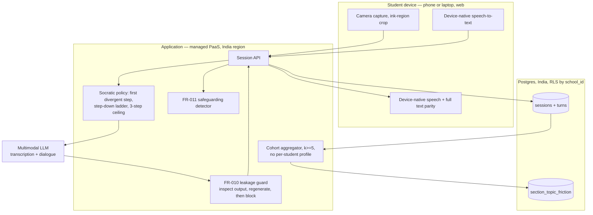

# Technical Architecture Review

> Written to be attacked. Every recommendation states what would have to be true for it
> to be wrong, and every subsystem shows the option I rejected and why.

---

## 0. Scope correction — three subsystems in the brief no longer exist

The phase-3 brief asked for options analysis on **real-time voice, the avatar, and the
canvas protocol**. All three were removed at the gate:

| Brief asked for | Status | Decided in |
|---|---|---|
| Real-time voice / sub-second barge-in | **Cut.** v0 is push-to-talk | `GD-02` |
| Photoreal avatar | **Cut** from the product; investor-demo build only | `GD-01` |
| 20,000×20,000 canvas protocol | **Cut.** Input is a photograph of paper | PRD §2 |

Producing a decision matrix for subsystems nobody is building would be theatre. §7 records
the avatar call formally because the brief demands it; the rest of this document covers
**the seven subsystems that actually exist**.

---

## 1. What the architecture has to survive

Five constraints, all measured or decided, not assumed:

| Constraint | Value | Source |
|---|---|---|
| Revenue ceiling | **₹750/student/year (~$8.52)** | `09-ops/00-cost-model.md` §5 |
| Engineering capacity | **One person**, zero budget | `A-018`, `GD-09` |
| Leakage requirement | **<5%**; achieved 0% with v2 + guard | `07-quality/00-spk1-results.md` |
| Transcription accuracy | **87.5%** — requires `FR-026` confirmation | `07-quality/01-pq1-results.md` |
| Legal | India DPDP; **no per-student behavioural profile** | `GD-07`, commences 2027-05-13 |

**Decision weighting.** A solo builder with no money and a 90-day horizon does not have the
same weights as a funded team, and pretending otherwise produces a plan that cannot be
executed:

| Criterion | Weight | Why |
|---|---|---|
| **Build effort** | **30%** | One engineer. Effort *is* the schedule |
| **Operational risk** | 20% | Nobody to page at 2am |
| **Cost / student-hour** | 15% | Real, but cost-model §2 shows variable cost is not the binding constraint |
| **Compliance fit** | 15% | DPDP is non-negotiable and expensive to retrofit |
| **Latency** | 10% | Turn-based, not conversational. A 3s reply is fine; this would be 30% in the original full-duplex design |
| **Vendor lock-in** | 10% | Matters at Series A, not at pilot |

Scores are 1–5, weighted, best total wins. Losing options are shown because the review
board should see what was rejected.

---

## 2. Subsystem options

### 2.1 Transcription — reading the student's handwriting

| Option | Build | Ops | Cost | Compl. | Lat. | Lock-in | **Total** |
|---|---|---|---|---|---|---|---|
| **A. Multimodal LLM does OCR inline** | 5 | 5 | 4 | 4 | 3 | 3 | **4.35** |
| B. Dedicated OCR (Mathpix) → LLM | 3 | 4 | 2 | 3 | 4 | 2 | 3.05 |
| C. Self-hosted OCR model | 1 | 2 | 5 | 5 | 3 | 5 | 2.70 |

**Recommend A.** Measured at 87.5% (`PQ-01`), needs no second vendor, no model hosting and
no separate bill. B adds a metered per-page cost against a ₹750/year ceiling and a second
failure domain, for a quality gain nobody has demonstrated. C is a research project.

**What would make this wrong:** if `FR-026` confirmation proves too annoying in user testing
and accuracy must reach 92% without it, B becomes worth measuring. Test before assuming.

### 2.2 Socratic dialogue and the leakage guard

| Option | Build | Ops | Cost | Compl. | Lat. | Lock-in | **Total** |
|---|---|---|---|---|---|---|---|
| A. System prompt only | 5 | 4 | 5 | 3 | 5 | 4 | **4.35** |
| **B. Prompt + independent output guard** | 4 | 4 | 4 | 4 | 4 | 4 | 4.00 |
| C. Prompt + guard + independent answer derivation | 3 | 3 | 3 | 5 | 3 | 4 | 3.40 |

**Recommend B, and I am overriding the matrix.** This is the one place the weighted score is
misleading and it should be visible rather than hidden: A scores highest because it is free
and easy, and it is *measurably* the option that leaks. `SPK-1` showed a weak prompt leaking
**94.4%** and the guard taking it to **0%**. Prompt-only has no floor against attacks nobody
has thought of, and regresses silently on model upgrade.

C — deriving the correct answer independently so the guard can check against ground truth —
is what the guard really wants, and it costs a second inference path per turn. **Defer to
v1**, because B's regenerate-on-detection already repaired 30 of 34 leaks without knowing
the answer.

### 2.3 Inference routing

| Option | Build | Ops | Cost | Compl. | Lat. | Lock-in | **Total** |
|---|---|---|---|---|---|---|---|
| **A. Thin provider abstraction, one primary** | 4 | 4 | 4 | 4 | 4 | 4 | **4.00** |
| B. Direct SDK, single provider | 5 | 4 | 4 | 3 | 4 | 1 | 3.75 |
| C. Gateway (OmniRoute / LiteLLM) | 3 | 3 | 4 | 3 | 3 | 5 | 3.40 |

**Recommend A** — an interface with two implementations, roughly 100 lines. The spikes
proved its worth: the harness swapped between OpenRouter, a local gateway and Gemini by
changing one flag, and that portability is what let us measure anything at all when a
provider rate-limited us.

**⚠️ Two measured findings that constrain model selection** (`ADR-007`):

1. **Reasoning models return empty or truncated output under budget pressure.** Observed in
   three independent harnesses. In production this is a student who asked for help and got
   silence. **Any candidate model must be validated for non-empty completion under long
   context, and empty output must be a first-class error with a designed fallback.**
2. **`gemini-2.5-flash-lite` is unavailable to new accounts**, and newer tiers (3.5, 3.8)
   were too rate-limited on free tiers to measure at all. **Do not assume newer is better
   without measuring it.**

### 2.4 Voice I/O

| Option | Build | Ops | Cost | Compl. | Lat. | Lock-in | **Total** |
|---|---|---|---|---|---|---|---|
| **A. Device-native (Web Speech API)** | 5 | 5 | 5 | 4 | 4 | 4 | **4.60** |
| B. Vendor ASR/TTS | 3 | 3 | 1 | 3 | 5 | 2 | 2.75 |
| C. Text only, no voice | 5 | 5 | 5 | 5 | 5 | 5 | 5.00* |

\* C scores highest and is **rejected on product grounds, not technical ones** — voice is the
low-friction input that makes this usable on a phone at 9pm, and `FR-007` requires text
parity anyway, so C is a subset of A rather than an alternative to it.

**Recommend A.** Vendor TTS alone is **$0.030/session against a $0.017–0.033 total budget** —
it consumes the entire allowance by itself. Device-native is free and adequate.
**Open risk `PQ-03`:** nobody has tested whether robotic device TTS is acceptable to a
16-year-old. Five students, one afternoon.

### 2.5 Data layer and multi-tenancy

| Option | Build | Ops | Cost | Compl. | Lat. | Lock-in | **Total** |
|---|---|---|---|---|---|---|---|
| **A. Single Postgres, `school_id` + RLS** | 4 | 4 | 5 | 4 | 4 | 4 | **4.15** |
| B. Schema-per-tenant | 3 | 3 | 4 | 5 | 4 | 4 | 3.65 |
| C. Database-per-tenant | 1 | 2 | 2 | 5 | 4 | 3 | 2.40 |

**Recommend A**, with row-level security enforced **in the database, not the application** —
an application-layer `WHERE school_id = ?` is one forgotten clause away from a cross-school
leak involving children's data.

**The schema constraint that outranks the matrix (`GD-07`):** there is **no per-student
cognitive profile table**, because DPDP §9(3) prohibits behavioural monitoring of under-18s
absolutely, with no consent gateway. Session signal aggregates into a
`section_topic_friction` row and the individual record is discarded. `FR-024`'s k≥5
suppression belongs in the **query layer, not the UI** — a UI-only guard is bypassed by
anyone with API access.

### 2.6 Identity and rostering

| Option | Build | Ops | Cost | Compl. | Lat. | Lock-in | **Total** |
|---|---|---|---|---|---|---|---|
| **A. CSV roster import + school-issued codes** | 5 | 4 | 5 | 4 | 4 | 5 | **4.55** |
| B. Google Workspace SSO | 3 | 4 | 4 | 4 | 4 | 3 | 3.65 |
| C. LTI 1.3 / OneRoster | 1 | 3 | 3 | 4 | 4 | 4 | 2.85 |

**Recommend A for the pilot, B before the second school. This reverses my phase-1 position
and I should say so.** Discovery called SSO "pilot-blocking", reasoning from GCC
international schools with managed Google estates. India-first changes the premise:
AP/Telangana private schools frequently have no managed identity to federate with, and
building LTI for three schools that cannot use it is the definition of premature.

**What would make this wrong:** if the first school runs Google Workspace for Education, go
straight to B. Ask before building — `TQ-01`.

### 2.7 Hosting and data residency

| Option | Build | Ops | Cost | Compl. | Lat. | Lock-in | **Total** |
|---|---|---|---|---|---|---|---|
| **A. Managed PaaS, India region** | 5 | 4 | 4 | 4 | 4 | 3 | **4.15** |
| B. Cloud VMs (AWS/GCP Mumbai) | 2 | 3 | 4 | 5 | 4 | 4 | 3.35 |
| C. Self-hosted VPS | 2 | 1 | 5 | 4 | 3 | 5 | 2.80 |

**Recommend A.** One engineer cannot also be a platform team. Requirement: **student data at
rest in India** (`NFR-007`).

Honest limitation: the *inference provider* sits outside India regardless, so the DPA and
the lawful transfer basis matter more than where the database lives. That is a legal
question (`SPK-3`), not an infrastructure one, and choosing a Mumbai region does not answer
it.

---

## 3. Recommended architecture

**The load-bearing property:** every model output passes through `GUARD` before it reaches a
student. That is the only component whose failure is silent and unrecoverable — a leaked
answer cannot be un-seen.

---

## 4. Capacity planning

Assumptions: 35% weekly active (`SM-L1`), 2 sessions/student/week, 30 teaching weeks,
8 turns/session, ~400 KB per image, evening peak with ~40% of daily volume in two hours.

| | **1k students** | **50k students** | **500k students** |
|---|---|---|---|
| Weekly active | 350 | 17,500 | 175,000 |
| Sessions/day | ~100 | ~5,000 | ~50,000 |
| **Peak inference req/s** | **~0.2** | **~9** | **~90** |
| Images/day | ~200 | ~10,000 | ~100,000 |
| Storage @ 30-day retention | ~2.4 GB | ~120 GB | ~1.2 TB |
| Inference cost/day | ~$0.50 | ~$25 | ~$250 |
| Shape | 1 small instance | 2–3 instances + read replica | Queue, autoscale, CDN, sharding review |

**The turn-based design is what makes this tractable.** Push-to-talk means no persistent
connections, no media servers, no TURN relay — at 500k students the peak is ~90 req/s of
ordinary HTTP. The original full-duplex design would have required ~175,000 concurrent
WebRTC sessions at peak, which is a different company with a different team.

**At 50k+ the binding constraint is provider rate limits, not our infrastructure.** Every
measurement in the spikes was blocked by quota and never by compute. Capacity planning at
that scale is a commercial conversation with a model provider, not an engineering one.

---

## 5. Failure modes

| # | Failure | Detection | Consequence | Mitigation |
|---|---|---|---|---|
| **F1** | Guard fails open; answer reaches student | Leakage suite in CI | **Brand promise dies publicly** | **Fail closed** — on guard error serve `GUARD_FALLBACK`. Never ship a reply the guard could not check |
| **F2** | Model returns empty or truncated output | `finish_reason` + empty-content check | Student gets silence mid-question | Observed 3× in spikes. Retry, then a designed fallback. **Never render an empty turn** |
| **F3** | Transcription wrong; tutor coaches phantom working | `FR-026` confirmation | Student loses trust in one turn | The confirmation step *is* the mitigation, which is why it is a v0 must |
| **F4** | Provider outage or rate limit | Error rate | Product down at peak homework hour | Secondary provider behind the §2.3 abstraction; degrade to text-only |
| **F5** | Safeguarding disclosure missed | Audit sampling | **Unacceptable** | Conservative detector, human review of every flag, log everything |
| **F6** | Cross-tenant data leak | RLS tests in CI | Children's data across schools; contract and legal exposure | RLS in the database; a test asserting school A cannot read school B |
| **F7** | k<5 aggregate re-identifies a student | Unit test on the query | DPDP §9(3) exposure | Suppression in the query layer, not the UI |
| **F8** | Cost per session exceeds budget | Per-session cost telemetry | Margin inversion | Alert at 2× modelled; cap turns per session |

**F1 and F5 are the two that end the company. Both fail closed by design.**

---

## 6. What I am deliberately not building

Message queue · Redis/caching · microservices · Kubernetes · custom auth · real-time
infrastructure · admin SPA (server-rendered pages instead) · observability platform beyond
structured logs plus one uptime check.

At 1k students none of these earn their operational cost, and each is one more thing a
single person has to keep alive. Every one is addable when a measurement says so.

---

## 7. The avatar call, recorded formally

The brief demands a buy-vs-build decision, so here it is on the record even though `GD-01`
settled it.

| Option | Cost per 20-min session | Verdict |
|---|---|---|
| **Buy** (Tavus, $0.26–0.37/min) | **$5.20–7.40** | **~1.8× a student's entire annual revenue, in one session** |
| **Build** (own render pipeline) | Months of engineering | Not available to a solo builder |
| **Stylised non-photoreal presence** | **~$0** | ✅ **Recommended** |

**Decision: no avatar in the student product at Indian pricing.** It ships as a separate
investor-demo build. This is arithmetic rather than taste — and it was the only subsystem
where the original design would have inverted the unit economics on its own.

---

## 8. ADRs this implies

| ADR | Decision | Status |
|---|---|---|
| ADR-001 | Voice: push-to-talk, device-native | Ready to accept (`GD-02`, §2.4) |
| ADR-002 | Avatar: demo-only | ✅ Accepted (`GD-01`, §7) |
| ADR-004 | Pedagogy: prompt **+** independent guard | Ready — measured, §2.2 |
| ADR-005 | Multi-tenancy: shared Postgres + RLS | Ready, §2.5 |
| ADR-006 | Canvas engine | **Moot** — no canvas in v0. Revisit at v1 |
| ADR-007 | Inference routing + model constraints | Ready — two measured constraints, §2.3 |
| ADR-009 | Data residency: India at rest; DPA for inference transfer | Needs `SPK-3` |
| ADR-010 | Identity: CSV roster for pilot, SSO at school #2 | Ready, §2.6 |
| ADR-014 | Analytics: cohort-only, k≥5 in the query layer | Ready (`GD-07`, §2.5) |
| **ADR-015** | **New:** empty/truncated model output is a first-class error | Ready — measured 3×, §2.3 |

---

## 9. Open questions

| ID | Question | Blocks |
|---|---|---|
| `PQ-03` | Is device-native TTS acceptable to a 16-year-old? | §2.4 — and the whole cost model |
| `TQ-01` | Does the pilot school run Google Workspace? | §2.6 — roster vs SSO |
| `TQ-02` | Does the silent-correction failure mode exist — does the model fix a student's error? | `FR-002`'s untested half |
| `TQ-03` | Which provider, at what committed rate limit, for 50k+? | §4 capacity |
| `CQ-05` | Re-price the cost model against `flash-lite-latest` | `09-ops/` |

---

## 10. What I need at this gate

1. **Approve the seven subsystem calls**, or challenge the weighting in §1 — it is the most
   arguable thing in this document, and every matrix result follows from it.
2. **Note the two places I overrode my own matrix** (§2.2 prompt-only, §2.4 text-only) and
   the one place I reversed a phase-1 position (§2.6 SSO). Those are the honest parts, and
   the places to push hardest.
3. **Answer `TQ-01`** — one question to the pilot school, and it changes §2.6 immediately.

---

## Changelog

| Version | Date | Author | Change |
|---------|------|--------|--------|
| 0.1.0 | 2026-09-14 | CTO (incoming) | Initial TAR. 7 subsystems, re-scoped after gate decisions removed 3 from the brief. Capacity at 1k/50k/500k, 8 failure modes, avatar call recorded. |

## Related documents

- [`../02-prd/00-prd.md`](../02-prd/00-prd.md) — requirements this implements
- [`../07-quality/00-spk1-results.md`](../07-quality/00-spk1-results.md) · [`01-pq1-results.md`](../07-quality/01-pq1-results.md) — the measurements
- [`../09-ops/00-cost-model.md`](../09-ops/00-cost-model.md) — the price ceiling
- [`../00-context/decision-log.md`](../00-context/decision-log.md) — ADR register
