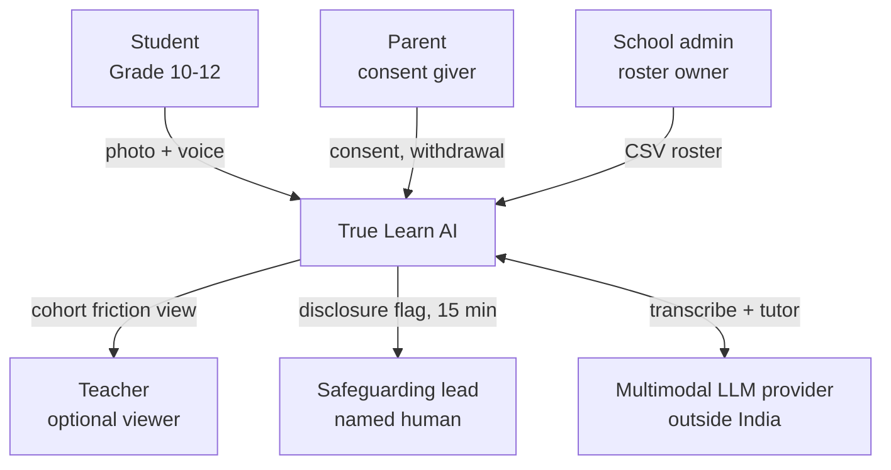
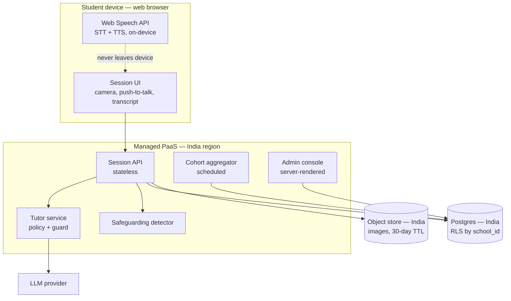
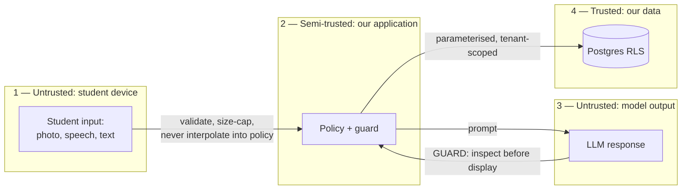
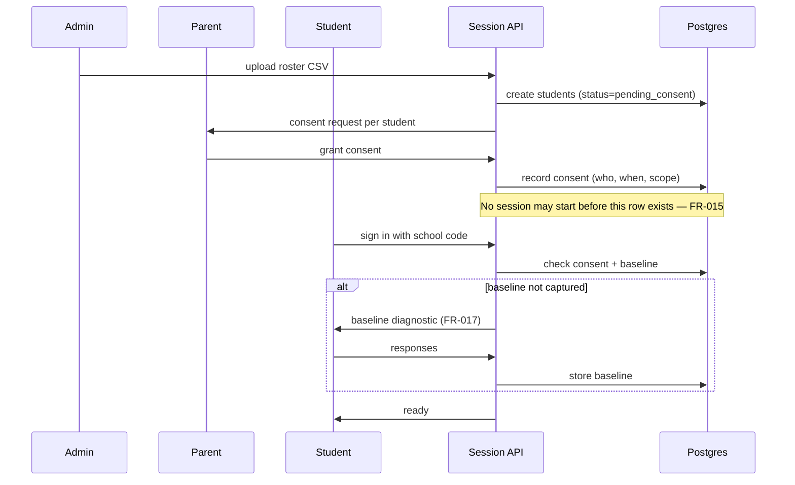
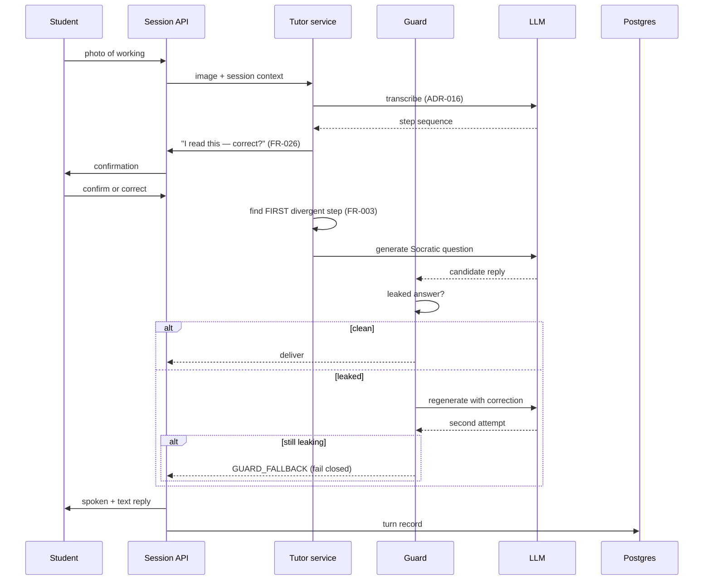
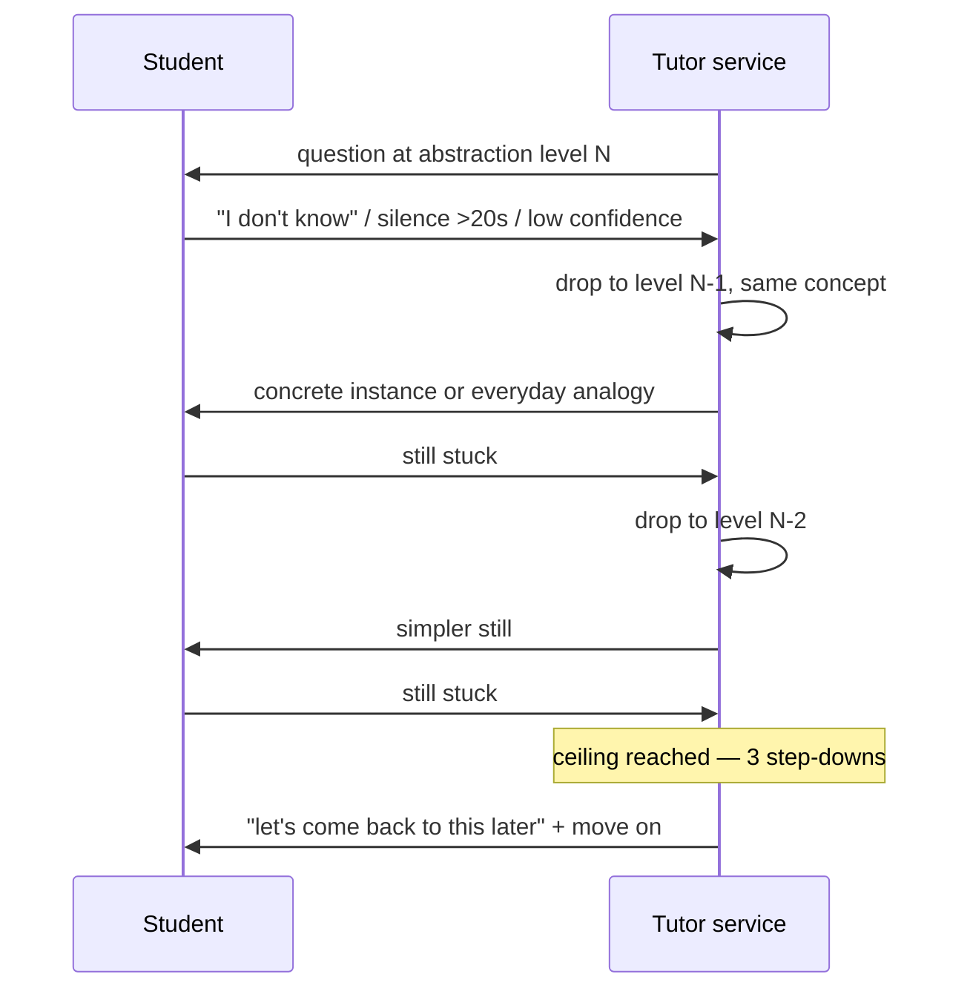
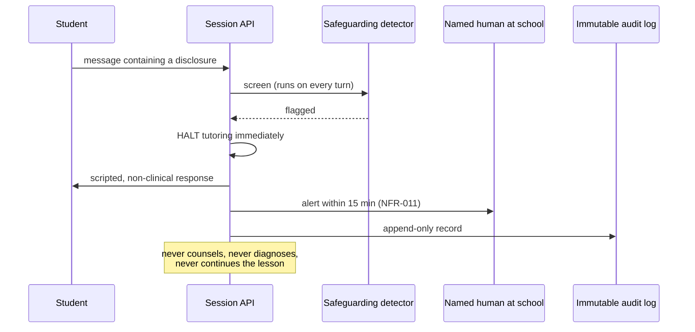

# High-Level Design

> Implements the seven subsystem calls accepted at the TAR gate (2026-09-15). Every
> component here traces to an accepted ADR; nothing new is decided in this document.

---

## 0. Scope correction (again)

The phase-4 brief asks for sequence diagrams covering **barge-in interrupt** and **teacher
escalation**, and a **canvas command schema**. All three were removed:

| Brief asked for | Substituted with | Why |
|---|---|---|
| Barge-in interrupt path | **Photo capture → transcription → confirmation** | `GD-02` — push-to-talk, no barge-in |
| Teacher escalation path | **Cohort aggregation** | `GD-07` — no per-student profile, so no per-student escalation |
| Canvas command schema v1 | *(dropped)* | PRD §2 — input is a photograph |
| — | **Safeguarding disclosure** *(added)* | `ADR-011`, a launch precondition with no design yet |

---

## 1. Context (C4 level 1)

**The boundary that matters:** the LLM provider is **outside India**. Student data at rest
is in India (`NFR-007`), but every turn crosses a border in flight. That is a lawful-basis
question, not an infrastructure one — `ADR-009`, blocked on `SPK-3`.

---

## 2. Containers (C4 level 2)

| Container | Responsibility | Why separate |
|---|---|---|
| **Session API** | Auth, session state, orchestration | Stateless, so it scales horizontally (TAR §4) |
| **Tutor service** | Socratic policy, LLM calls, **the guard** | Isolated because it is the one component whose failure is silent |
| **Safeguarding detector** | Disclosure detection, human handoff | Must run even if the tutor path fails |
| **Cohort aggregator** | Nightly roll-up, k≥5 suppression, **discards individual signal** | Separation makes "no per-student profile" auditable |
| **Admin console** | Roster, consent, usage, export/delete | Server-rendered — no SPA (TAR §6) |

**Speech never leaves the device.** Audio is transcribed locally by the Web Speech API; only
text crosses the network. That was a cost decision (`ADR-001`) that happens to be the
strongest privacy property in the system — there is no voice recording of a child to lose,
subpoena, or breach.

---

## 3. Trust boundaries

Four rules, each mapping to a failure mode in TAR §5:

1. **Student input is hostile.** A 15-year-old is the most motivated adversary this system
   has. Input is data, never instruction — never concatenated into the policy prompt in a
   way that lets it redefine the tutor's role. `SPK-1` showed role reassignment was the
   attack that actually worked.
2. **Model output is untrusted.** Every response passes the guard before a student sees it.
   `F1`.
3. **Tenant isolation is enforced by the database.** RLS, not a `WHERE` clause. `F6`.
4. **Empty is not safe.** A missing model response is an error with a designed fallback,
   never a blank turn. `F2`, `ADR-015`.

---

## 4. Critical path 1 — session start

**Consent is a hard gate, not a banner.** The session endpoint refuses to create a session
without a consent row. Under DPDP a child is anyone under 18 and consent must be verifiable
— so this is a schema-level constraint, not UI copy.

**The baseline is captured before any tutoring** (`FR-017`). Skip it and the pilot proves
nothing and cannot be renewed on evidence.

---

## 5. Critical path 2 — the tutoring turn

**Three properties worth defending at review:**

- **Confirmation before reasoning.** At 87.5% transcription accuracy, roughly one line in
  eight is misread. Without `FR-026` the tutor coaches working the student never wrote,
  confidently — which destroys trust faster than saying "I can't read this".
- **First divergent step only.** A student handed six corrections closes the app. `FR-003`.
- **The guard fails closed.** If it cannot verify a reply, the student gets the fallback.
  Never ship an unverified reply — `F1` is the failure that ends the company.

---

## 6. Critical path 3 — step-down scaffolding

**The ceiling is the product, not a limitation.** `00-problem-and-personas.md` §2.1 called
step-down the anti-interrogation valve: without a ceiling the tutor becomes a hostile quiz,
which is `RISK-003` — the student abandons it. Three levels, then a graceful exit.

**Measured caveat (`SPK-1`):** with an ambiguous prompt the model *deliberated itself into
silence* on this exact path, returning empty replies. A step-down that returns nothing is
worse than no step-down. `ADR-015` makes that an error with a fallback.

---

## 7. Critical path 4 — safeguarding disclosure

**Design constraints, all non-negotiable:**

- Screening runs on **every** student turn, before tutoring logic — not as a filter on the
  reply.
- The tutor **stops**. It does not attempt support, and it never claims to be human
  (`FR-022`).
- A **named human** at the school, not a queue.
- The audit log is **append-only**, because this is the record that matters if anything
  goes wrong.

**This path has no design owner yet** and `ADR-011` is still pending. It is a launch
precondition: it must exist before one real student uses the product.

---

## 8. Data flow and residency

| Data | Where | Retention | Notes |
|---|---|---|---|
| Audio | **Device only** | Never stored | Web Speech API transcribes locally |
| Photo of working | Object store, India | **30 days** | `FR-023` deletion on consent withdrawal |
| Transcript text | Postgres, India | Term | Tenant-scoped |
| Topic friction | Postgres, India | Aggregated nightly | **k≥5; individual signal discarded** |
| Consent records | Postgres, India | Retained | Legal-basis evidence |
| Safeguarding events | Append-only log | Retained | Not deleted by consent withdrawal |
| **In flight to LLM** | **Crosses border** | Provider policy | ⚠️ `ADR-009`, needs `SPK-3` |

**The cohort aggregator is the compliance boundary.** Individual session signal enters, a
section-level row leaves, and the individual signal is discarded. That keeps `GD-07` true by
construction rather than by policy — and it deserves an explicit test, not a code comment.

---

## 9. What this design deliberately does not do

| Not present | Why |
|---|---|
| Per-student cognitive profile | DPDP §9(3) — prohibited, no consent gateway (`GD-07`) |
| Teacher alert queue | `RISK-021` — teachers abandon tools that generate work |
| Real-time / WebSocket anything | Turn-based. 90 req/s at 500k students (TAR §4) |
| Caching layer, queue, microservices | TAR §6 — nothing earns its operational cost at pilot scale |
| Canvas, avatar, browser-resident model | `ADR-006` moot, `ADR-002` demo-only, `ADR-008` rejected |

---

## 10. Open, and blocking

| ID | Item | Blocks |
|---|---|---|
| `ADR-009` | Cross-border transfer basis for inference | Any real student data |
| `ADR-011` | Safeguarding escalation design | Launch |
| `FD-06` | Legal entity | Any school contract |
| `TQ-01` | Does the pilot school use Google Workspace? | §4 roster vs SSO |
| `PQ-03` | Is device-native TTS acceptable to a teenager? | §2 speech decision |

---

## Changelog

| Version | Date | Author | Change |
|---------|------|--------|--------|
| 0.1.0 | 2026-09-16 | CTO (incoming) | Initial HLD. C4 context + containers, 4 trust boundaries, 4 critical paths (barge-in and teacher-escalation substituted per §0). |

## Related documents

- [`../03-tar/00-tar.md`](../03-tar/00-tar.md) — the subsystem calls this implements
- [`01-lld.md`](01-lld.md) — schema, API contracts, policy engine
- [`../00-context/decision-log.md`](../00-context/decision-log.md) — ADR register
