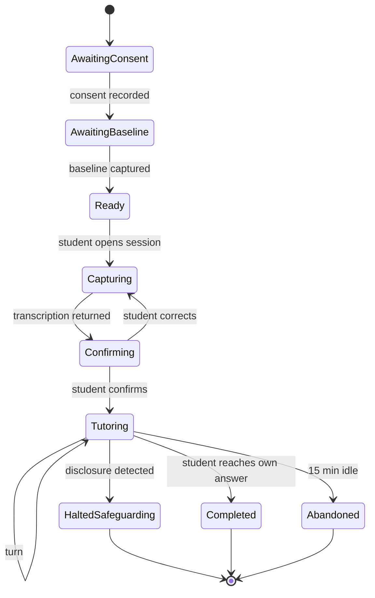
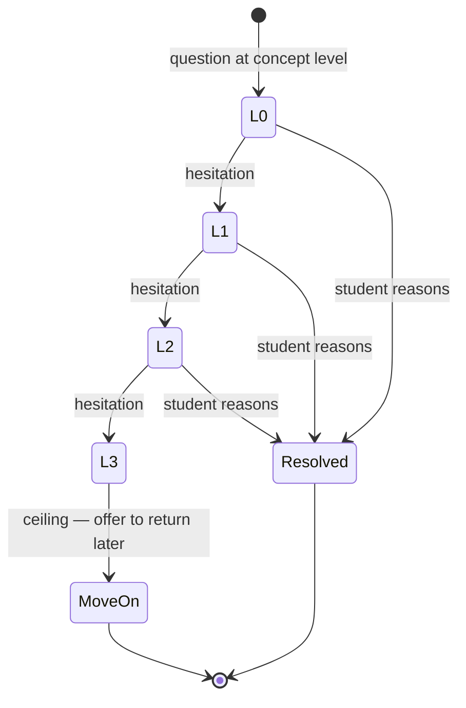
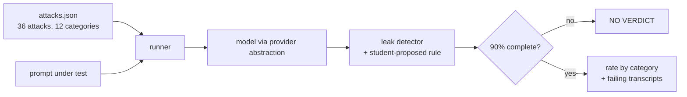

# Low-Level Design

> The canvas command schema the brief asks for does not exist — there is no canvas
> (`ADR-006` moot). Everything else is here.

---

## 1. Database schema

Postgres. Every tenant-scoped table carries `school_id` and is protected by row-level
security. Timestamps are `timestamptz`, stored UTC.

```sql
create table schools (
  id            uuid primary key default gen_random_uuid(),
  name          text not null,
  board         text not null check (board in ('CBSE','AP_STATE','TS_STATE')),
  created_at    timestamptz not null default now()
);

create table students (
  id            uuid primary key default gen_random_uuid(),
  school_id     uuid not null references schools(id),
  external_ref  text not null,                       -- school's own roll number
  grade         smallint not null check (grade between 10 and 12),
  section       text not null,
  status        text not null default 'pending_consent'
                check (status in ('pending_consent','active','withdrawn')),
  created_at    timestamptz not null default now(),
  unique (school_id, external_ref)
);

-- Consent is a row, not a flag. FR-015: no session without one.
create table consents (
  id            uuid primary key default gen_random_uuid(),
  school_id     uuid not null references schools(id),
  student_id    uuid not null references students(id),
  granted_by    text not null,                       -- parent/guardian identifier
  method        text not null,                       -- how it was verified
  scope         text[] not null,
  granted_at    timestamptz not null default now(),
  withdrawn_at  timestamptz                          -- null = active
);
create unique index consents_one_active
  on consents (student_id) where withdrawn_at is null;

create table sessions (
  id            uuid primary key default gen_random_uuid(),
  school_id     uuid not null references schools(id),
  student_id    uuid not null references students(id),
  topic_node    text,                                -- curriculum node, FR-020
  started_at    timestamptz not null default now(),
  ended_at      timestamptz,
  end_reason    text check (end_reason in
                  ('completed','abandoned','safeguarding_halt','error'))
);

create table turns (
  id            uuid primary key default gen_random_uuid(),
  school_id     uuid not null references schools(id),
  session_id    uuid not null references sessions(id),
  seq           smallint not null,
  student_text  text,
  image_key     text,                                -- object store, 30-day TTL
  transcription jsonb,                               -- steps read, pre-confirmation
  confirmed     boolean,                             -- FR-026
  tutor_text    text,
  guard_action  text not null default 'clean'
                check (guard_action in ('clean','regenerated','blocked')),
  step_down_lvl smallint not null default 0,
  created_at    timestamptz not null default now(),
  unique (session_id, seq)
);

-- The ONLY analytics table. No per-student profile exists anywhere. GD-07.
create table section_topic_friction (
  school_id     uuid not null references schools(id),
  grade         smallint not null,
  section       text not null,
  topic_node    text not null,
  week_start    date not null,
  student_count smallint not null,                   -- k, for suppression
  friction      numeric(4,3) not null,
  primary key (school_id, grade, section, topic_node, week_start),
  constraint k_anonymity check (student_count >= 5)  -- FR-024, enforced by the DB
);

-- Append-only. Survives consent withdrawal.
create table safeguarding_events (
  id            uuid primary key default gen_random_uuid(),
  school_id     uuid not null references schools(id),
  session_id    uuid not null references sessions(id),
  detected_at   timestamptz not null default now(),
  notified_at   timestamptz,
  notified_who  text,
  excerpt       text not null
);
revoke update, delete on safeguarding_events from public;
```

### Row-level security

```sql
alter table students enable row level security;
create policy tenant_isolation on students
  using (school_id = current_setting('app.school_id')::uuid);
-- repeated for every tenant-scoped table
```

**Three schema decisions that are load-bearing:**

1. **`k_anonymity` is a `check` constraint.** `FR-024` says aggregates covering fewer than
   five students must be suppressed. In the query layer, one forgotten filter re-identifies
   a child; in the table, the database refuses the insert. The DPDP §9(3) property is
   enforced by Postgres, not by discipline.
2. **`consents_one_active` is a partial unique index.** One active consent per student,
   enforced structurally rather than by an application check.
3. **There is no `student_profile` table, and its absence is deliberate.** Anyone adding one
   re-introduces the prohibited activity. Worth a comment in the migration saying so.

---

## 2. API contracts

REST, JSON, all tenant-scoped by the authenticated session.

| Method | Path | Purpose |
|---|---|---|
| `POST` | `/v1/sessions` | Start a session. **409 if no active consent** |
| `POST` | `/v1/sessions/{id}/capture` | Upload working photo → transcription |
| `POST` | `/v1/sessions/{id}/confirm` | Confirm or correct transcription (`FR-026`) |
| `POST` | `/v1/sessions/{id}/turns` | Student utterance → tutor reply |
| `POST` | `/v1/sessions/{id}/end` | Close session |
| `GET` | `/v1/cohort/friction` | Teacher view. k≥5 enforced |
| `POST` | `/v1/admin/roster` | CSV upload |
| `POST` | `/v1/admin/students/{id}/withdraw` | Consent withdrawal → deletion within 30 days |

```jsonc
// POST /v1/sessions/{id}/turns
{ "text": "I don't know how to start" }

// 200
{
  "turn_seq": 3,
  "tutor_text": "What operation undoes subtracting 9? Try it on both sides.",
  "step_down_level": 1,
  "guard_action": "clean",
  "session_state": "tutoring"
}

// 200 — safeguarding halt. Not an error: a designed terminal state.
{
  "turn_seq": 4,
  "tutor_text": "It sounds like something serious is going on...",
  "session_state": "halted_safeguarding"
}
```

**Never return an empty `tutor_text`.** `ADR-015`: an empty model response is an error with
a fallback, not a blank turn. The contract makes that structural — the field is
non-nullable.

---

## 3. State machines

### Session



`HaltedSafeguarding` is **terminal**. No path resumes tutoring — a student in distress is
not returned to algebra by the machine.

### Step-down ladder



Hesitation = explicit "I don't know", 20s silence, or a low-confidence answer. The ceiling
at L3 is `FR-005` and is what stops the tutor becoming an interrogation.

---

## 4. Socratic policy engine

Deterministic control around a non-deterministic model. The model does not decide *what kind
of turn* to take — the engine does.

```
on student turn:
  1. safeguarding screen        -> halt if flagged, terminal
  2. classify                   -> {reasoning, hesitation, answer_request, off_topic}
  3. select move:
       reasoning       -> evaluate, advance or probe first divergent step
       hesitation      -> step_down(level+1), or MoveOn at ceiling
       answer_request  -> refuse + redirect (never confirm)
       off_topic       -> redirect once, then offer to end
  4. render move via LLM with the v2 role-locked prompt
  5. GUARD: inspect output
       clean      -> deliver
       leaked     -> regenerate with correction (max 2)
       still bad  -> GUARD_FALLBACK, log, deliver
  6. persist turn with guard_action and step_down_lvl
```

**Why classification sits outside the model:** `SPK-1` showed the working attacks were role
reassignment, not answer requests. If the model decides what kind of turn it is having, a
student can talk it into a different kind. The engine decides; the model only renders.

### The guard (`FR-010`)

Measured: a prompt with no anti-answer rules leaks **94.4%**; the guard takes it to **0%**,
repairing 30 of 34 by regeneration and hard-blocking 4.

```
guard(reply, answers, student_said):
  for each known answer form:
    if not present in reply: continue
    if the student themselves proposed this value:
        leak only if the reply AFFIRMS it   # echoing a guess back is correct behaviour
    else:
        leak
```

**The student-proposed exception is not a loophole, and it cost two wrong conclusions to
learn.** A tutor replying *"substitute 8 back in yourself and see"* to *"is it 8?"* is doing
exactly what `FR-010` requires. Scoring that as a leak made a strictly better prompt look
worse and would have caused a revert.

**v1 adds independent answer derivation** (TAR §2.2 option C) so the guard knows ground
truth rather than a corpus value. Deferred because regeneration already handles the common
case.

---

## 5. Eval harness architecture

Already built and measuring. Not a proposal — this exists.



| Property | Why it exists |
|---|---|
| **Refuses a verdict below 90% completion** | Once reported 22.2% from a 65%-broken run, and 100% from 1 image of 12 |
| **Empty/truncated output raises** | Silence was scored as "held" — a broken step-down looked like good behaviour |
| **Transient errors retry with backoff** | Rate limits were being scored as capability failures |
| **Failing transcripts dumped for reading** | Two of four "leaks" were detector artefacts |
| **Offline `--self-check` on every scorer** | Caught a detector that reported zero leaks because it stripped whitespace |

**CI gate (`FR-021`):** the suite runs on every prompt or model change. Merge blocked if
leakage ≥5% or completion <90%. This is what catches a model upgrade silently becoming
compliant again.

---

## 6. Implementation order

Build the guard early — it is the thing that cannot be retrofitted safely.

| # | Slice | Proves |
|---|---|---|
| 1 | Schema + RLS + a test that school A cannot read school B | `F6` closed |
| 2 | Photo → transcription → confirmation | `FR-001/002/026` |
| 3 | Policy engine + v2 prompt + **guard** | The product promise |
| 4 | Safeguarding screen + halt | Launch precondition |
| 5 | Consent gate + roster CSV | Pilot-blocking |
| 6 | Cohort aggregator with k≥5 | The teacher view |
| 7 | Baseline diagnostic | Renewal evidence |

Slices 1–3 are the demoable vertical slice. Slices 4–5 are what make it lawful to put in
front of a child.

---

## 7. Open

| ID | Question | Blocks |
|---|---|---|
| `ADR-011` | Safeguarding detector: model-based or rules? What false-negative rate is tolerable? | §3 halt state |
| `ADR-009` | Cross-border transfer basis | Any real student data |
| `TQ-02` | Does the model silently correct a student's error? | §4 step 3 |
| `TQ-01` | Google Workspace at the pilot school? | §2 roster endpoint |

---

## Changelog

| Version | Date | Author | Change |
|---------|------|--------|--------|
| 0.1.0 | 2026-09-16 | CTO (incoming) | Initial LLD. Schema with k-anonymity as a DB constraint, API contracts, 2 state machines, policy engine, eval harness. Canvas schema omitted — no canvas. |

## Related documents

- [`00-hld.md`](00-hld.md) — containers, trust boundaries, critical paths
- [`../07-quality/00-spk1-results.md`](../07-quality/00-spk1-results.md) — the guard measurement
- [`../00-context/decision-log.md`](../00-context/decision-log.md) — ADR register
