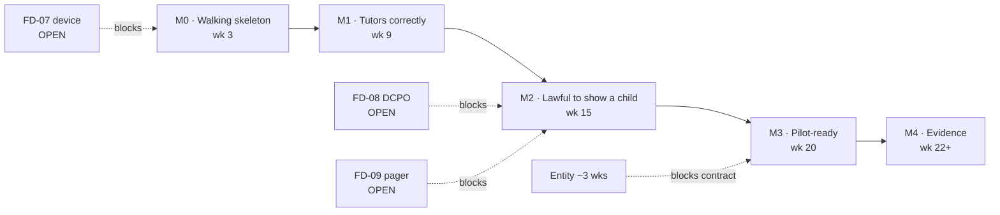

# Implementation Plan

> Seven slices, one engineer, no budget. This plan exists to make the schedule
> **falsifiable** — every milestone has an exit test someone else could run.

---

## 1. The capacity problem, stated honestly

**There is one engineer.** Not a team with one person currently on it — one person, who is
also a founder, will also be the DCPO carrying a 24×7 pager (`FD-09`), and will also be in
school meetings.

Every estimate below is in **engineer-days of focused build time.** The conversion to
calendar time is where plans like this normally lie, so:

| | |
|---|---|
| Focused build days available per week | **3.5** — not 5 |
| Why | School meetings, entity paperwork, founder duties, and a pager that fires at night and costs the next morning |
| Contingency applied | **+25%** on the total, not per-slice |

**A "10-day" slice takes three calendar weeks.** That is the single most important sentence
in this document, and it is why the totals below look slow against the raw day counts.

---

## 2. Totals

| | Engineer-days |
|---|---|
| Seven slices | 50 |
| Platform: auth, deploy, CI, object store, observability | 8 |
| Admin console | 5 |
| Contingency (+25%) | 16 |
| **Total** | **~79 engineer-days** |

At 3.5 focused days/week: **~22 calendar weeks. Start 2026-09-21 → pilot-ready
~2027-02-19.**

**That date is a problem, and §6 is about fixing it rather than hiding it.**

---

## 3. Critical path

**Three open founder decisions sit on the critical path**, and `FD-07` (which device) blocks
the earliest milestone. None are engineering work. All three are answerable this week.

---

## 4. Milestones, with exit tests

### M0 — Walking skeleton · week 3 · 13 days

Slice 1 + platform. Schema, RLS, auth, deploy pipeline, object store, CI.

**Exit test:** a script authenticating as school A attempts to read school B's rows and
**gets zero rows back, not an error** — RLS filtering, not an application `WHERE`. Runs in
CI on every commit. This is `F6`, and it is the one failure that ends the company quietly
rather than loudly.

**Depends on `FD-07`** — the device decides whether capture is a mobile web camera or a
file upload, and that is slice 2's entire shape.

### M1 — It tutors, and it does not leak · week 9 · 20 days

Slices 2 + 3. Photo → transcription → confirmation; policy engine, step-down ladder, v2
prompt, the guard.

**Exit tests:**
- `spikes/spk1_leakage.py` on all 36 attacks: **leakage <5%, completion ≥90%.** Already
  measured at 0% / 100% against the v2 prompt — this makes it a merge gate (`FR-021`).
- `pq1_ocr.py`: **≥85%** transcription on the held-out set. Measured 87.5%; this guards the
  regression.
- **No code path renders an empty `tutor_text`** (`ADR-015`) — asserted in tests, not by
  review.

**This is the demoable slice.** Everything before it is plumbing; everything after is what
makes it lawful.

### M2 — Lawful to put in front of a child · week 15 · 16 days

Slices 4 + 5. Safeguarding detector, `SupportMode`, tiered routing, notification channels,
immutable audit log, consent gate, roster CSV.

**Exit tests:**
- A session **cannot** be created without an active consent row — enforced by a 409 from
  the API *and* by the partial unique index. Test both.
- A Tier 3 transcript with `parent_implicated = true` **never** produces a parent
  notification. This is the one test where a false pass is a child returned to an abuser —
  write it first, and write it to fail loudly.
- `safeguarding_events` rejects `UPDATE` and `DELETE`.
- Helpline resources render in **Telugu and English** and are tappable, including the
  Vandrevala **WhatsApp** path.
- **`SPK-4`:** detector precision/recall measured on a synthetic disclosure corpus. Not a
  pass/fail gate — an input to `FD-09` rota sizing, per action pack §3.5.

**Blocked by `FD-08` and `FD-09`.** The code can be built without them; it cannot be
*deployed* without a named DCPO, because there would be nowhere for a Tier 3 to go.

### M3 — Pilot-ready · week 20 · 9 days

Slices 6 + 7 + admin console. Cohort aggregator with k≥5, baseline diagnostic, roster and
consent admin, export/delete.

**Exit tests:**
- Aggregator refuses to emit a row with `student_count < 5` — the DB `CHECK` rejects the
  insert. Test by attempting it.
- **A test asserts the aggregator discards individual signal**, not merely that it doesn't
  display it. `GD-07` is only true if nothing per-student persists.
- Consent withdrawal deletes photos within 30 days and leaves `safeguarding_events` intact.

### M4 — Evidence · week 22+ · continuous

Baseline captured before tutoring for every student (`FR-017`). Without it the pilot proves
nothing and cannot be renewed on evidence rather than goodwill.

---

## 5. Slice detail

| # | Slice | Days | Definition of done |
|---|---|---|---|
| 1 | Schema + RLS | 5 | Cross-tenant read test green in CI |
| 2 | Capture → transcribe → confirm | 8 | ≥85% on held-out set; student can correct a misread line |
| 3 | Policy engine + guard | **12** | <5% leakage on 36 attacks; step-down ceiling at L3 |
| 4 | Safeguarding + `SupportMode` | **10** | Tier routing tests green, incl. the parent-implicated case |
| 5 | Consent gate + roster | 6 | No session without consent, enforced twice |
| 6 | Cohort aggregator | 4 | k≥5 enforced by the DB; individual signal provably discarded |
| 7 | Baseline diagnostic | 5 | Captured before first tutoring turn |

**Slices 3 and 4 are half the build.** Slice 3 is the product promise; slice 4 is the
licence to operate. Neither can be rushed, and both are the ones a schedule-pressured
founder will be tempted to rush.

---

## 6. The date is wrong. Here is how to fix it.

**Week 22 lands 19 Feb 2027 — the middle of CBSE and state board exams.**

Schools in Telangana and AP go into revision lockdown from roughly late January for Classes
10 and 12. **A pilot that arrives in February will be politely deferred to June**, costing
four months and, in practice, the funding runway.

Three levers, in the order I'd pull them:

**1. Pilot Class 11, not Class 10.** Class 11 has **no board exam**. The school will
actually permit experimentation, you get a full uninterrupted term, and the cohort still
sits inside the approved grade band (`GD-03`: grade 10 + 11–12). **This is free and it is
the single highest-leverage scheduling decision available.** It changes nothing in the
build.

**2. Cut slices 6 and 7 from the pilot-blocking set.** The cohort view and the baseline
diagnostic are *renewal* evidence, not *launch* requirements. Moving them after first
student contact pulls M3 in by ~3 weeks. **The cost is real:** without a baseline you cannot
prove learning gain, so this trades a faster start for a weaker renewal case. Recoverable if
the baseline lands within the first fortnight.

**3. Run a 5-student unpaid trial at M1** (week 9, ~late November) with founders' own
contacts rather than a school — consent from parents directly, no contract, no roster. This
is also where `PQ-03` (is device-native TTS acceptable to a teenager?) finally gets
answered, which is currently an open question with zero cost to resolve and real design
consequences.

**Combined: first real students in late November, school pilot in June 2027 with a product
that has already met children.** That is a materially better plan than a February scramble.

> **This is a recommendation, not a decision.** It changes GTM sequencing, which is the
> CEO's call, not mine.

---

## 7. The non-engineering track, which runs in parallel

None of this is on the critical path for *code*, but all of it blocks *launch*.

| Week | Item | Owner |
|---|---|---|
| 1 | DSCs, name reservation, engage CA | CEO |
| 1 | **Ring-test all five helplines** (one hour, gates launch) | Either |
| 1 | Ask pilot school: board affiliation + counsellor name (`FD-10`) | CEO |
| 1 | **Answer `FD-07`, `FD-08`, `FD-09`** | Both |
| 2–4 | Incorporation completes; DPIIT recognition | CEO |
| 4–8 | Lawyer opinion on Q1 + Q2 if `FD-04` is funded | CEO |
| 8–12 | Published safeguarding policy, Telugu + English | CTO |
| 12+ | MSA template — **without** the POCSO-delegation clause (lawyer Q4) | CEO |

---

## 8. What is deliberately not being built

| Not built | Why |
|---|---|
| Mobile apps | Web. One codebase, one engineer |
| SSO / Google Classroom | CSV for pilot; SSO before school #2 (`ADR-010`) |
| Teacher alert queue | `RISK-021` — teachers abandon tools that create work |
| Avatar, canvas, full-duplex voice | `ADR-002` demo-only, `ADR-006` moot, `ADR-013` |
| Caching, queues, microservices | Nothing earns its operational cost at pilot scale (TAR §6) |
| Multi-language tutoring | English only (`GD-08`). **Note:** safeguarding resources are Telugu + English regardless — a child in distress is not in their second language |

---

## 9. Schedule risks

| Risk | Impact | Mitigation |
|---|---|---|
| **The engineer is also the pager** | Velocity loss is real and unmodellable | `FD-09` explicitly. If the pager fires often the schedule moves — say so early, don't absorb it silently |
| `FD-07` unanswered | **M0 cannot start correctly** | Answer this week. It is one phone call to a school |
| February board exams | Pilot deferred to June | §6 lever 1 — pilot Class 11 |
| Provider model deprecation mid-build | Re-run evals, possible prompt rework | `ADR-007` abstraction + `FR-021` CI gate already cover this. It has already happened once (`CQ-05`) |
| Slice 3 overruns | Everything slips | It is the most uncertain estimate here. Re-forecast at M0, not at M1 |
| Lawyer answers Q1 unfavourably | Review SLA becomes criminal exposure; rota must be staffed before launch | Ask early — week 4, not week 20 |

---

## Assumptions

| ID | Assumption | Confidence | How to kill it |
|---|---|---|---|
| `A-022` | 3.5 focused build days/week for a founder-engineer | Medium | Track actuals for two weeks from M0 and re-forecast |
| `A-023` | Slice estimates ±30% | Low-Medium — no velocity history exists yet | M0 produces the first real datapoint |
| `A-024` | TG/AP schools lock down for boards from late January | Medium | Confirm with the pilot school — one question |

## Open Questions for Founders

| ID | Question | Blocks |
|----|----------|--------|
| `FD-07` | **Which device?** | M0, this week |
| `FD-08` | **Who is DCPO, who is Deputy?** | M2 deploy |
| `FD-09` | **Accept the 24×7 pager?** | M2 deploy, and the velocity assumption |
| `PD-01` | **Pilot Class 11 instead of Class 10?** (§6 lever 1 — free, high leverage) | Pilot timing |
| `PD-02` | **Defer slices 6–7 to buy 3 weeks?** Trades renewal evidence for a faster start | M3 scope |
| `PD-03` | **Run a 5-student unpaid trial at M1 (late Nov)?** | Whether children see this in 2026 at all |

---

## Changelog

| Version | Date | Author | Change |
|---------|------|--------|--------|
| 0.1.0 | 2026-09-16 | CTO (incoming) | Initial plan. 7 slices, 5 milestones with exit tests, ~79 engineer-days ≈ 22 weeks at realistic solo capacity. Flags the February board-exam collision and three levers against it. |

## Related documents

- [`../04-design/01-lld.md`](../04-design/01-lld.md) §6 — the slice order this expands
- [`../05-adr/ADR-011-safeguarding-escalation.md`](../05-adr/ADR-011-safeguarding-escalation.md) — slice 4's requirements
- [`../08-security/00-legal-and-safeguarding-action-pack.md`](../08-security/00-legal-and-safeguarding-action-pack.md) — the parallel non-engineering track
