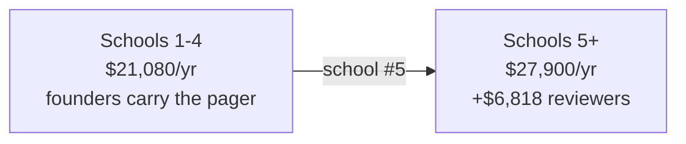

# Unit Economics and Pricing Model

> You asked me to model the price rather than pick one. Here is the model, the
> arithmetic behind it, and a recommendation.
>
> **Headline: variable cost is not the constraint, and the deck spent its entire economics
> slide on the wrong number.** What actually constrains this business is **how many schools
> two founders can sign**, and that is a pricing decision.
>
> **Two corrections since v0.1.0, both material:** gross margin *can* go negative at the low
> price points (§2), and the pricing structure has been rebuilt (§4–§5) after the original
> recommendation was found to benchmark a tutoring product against school software.

**FX assumption:** ₹88 = US$1. Not independently verified — treat INR figures as ±10%.

> ### ✅ `CQ-05` closed 2026-09-16 — re-priced, and one conclusion did not survive
>
> `gemini-flash-lite-latest` currently resolves to **Gemini 3.5 Flash-Lite: $0.30/1M input,
> $2.50/1M output** ([Google AI pricing](https://ai.google.dev/gemini-api/docs/pricing),
> retrieved 2026-09-16). Against the modelled $0.10/$0.40 that is **3× input and 6.25×
> output.**
>
> **What survived:** at ₹750+ variable cost is still not the constraint, and the
> school-count arithmetic still drives the pricing decision.
>
> **What did not:** this document previously asserted *"gross margin never goes negative."*
> **That is now false at ₹150/student/year under heavy engagement** — see §2. It was true
> at the modelled price and is not true at the real one. I am flagging it rather than
> quietly restating it, because it is exactly the kind of absolute that gets repeated in a
> pitch and then found by a diligence partner.
>
> **Also corrected: `CQ-06`.** `ADR-011` added a mandatory safeguarding on-call function
> this model did not carry at all. It is ~$6,800/year from school #5, and it moves the
> price recommendation. See §3.1 and §5.

---

## 1. Variable cost, bottom-up

Per tutoring session, on the architecture decided in `GD-01`/`GD-02` and PRD §6.1
(photo capture, push-to-talk, device-native speech, multimodal LLM doing OCR).

Assume a representative session: 2 photographs, 8 dialogue turns, ~500 output tokens.

| Component | Basis | Cost/session |
|---|---|---|
| LLM input (images + growing dialogue context) | ~25k tokens @ **$0.30/1M** | $0.0075 |
| LLM output | ~500 tokens @ **$2.50/1M** | $0.0013 |
| `FR-026` confirmation round-trip | Added after `PQ-01` | ~$0.0010 |
| **Guard answer derivation** | **TAR §2.2 option C, promoted to v0 2026-09-16.** Once per *problem*, not per turn | ~$0.0020 |
| ASR | Device-native (Web Speech API) | **$0.0000** |
| TTS | Device-native | **$0.0000** |
| OCR | Rides the multimodal LLM, not a metered service | $0.0000 |
| Image storage + egress | ~400 KB, 30-day retention | ~$0.0001 |
| Serverless compute | Per invocation | ~$0.0002 |
| **Subtotal** | | **~$0.012** |
| **Budgeted with headroom** | retries, failed OCR, long sessions | **$0.017** |

**All subsequent figures use $0.015/session — 3× the previous $0.005.**

> **The safeguarding screen is not in this table, and it must not be a second LLM call.**
> `ADR-011` runs it on **every** student turn. At ~$0.002/turn × 8 turns that is
> **$0.016/session — it would more than double session cost to catch under 1% of turns.**
>
> So the rules-first floor in `ADR-011` is not a stylistic preference, it is an economic
> requirement: **cheap deterministic rules on 100% of turns, model escalation only on
> suspicion.**
>
> ### ⚠️ Qualified 2026-09-16 by `SPK-4` — the saving may be near zero
>
> `SPK-4` found that **precise rules cannot classify** (0 of 18 held-out disclosures
> detected), so the architecture is now **rules triage, model classifies**. Cost therefore
> scales with the **escalation rate**, not with rules alone.
>
> Measured escalation on the (adversarial) test corpora was **74–88%**, which costs
> **$0.011–0.014/session against $0.016 for a model on every turn — almost no saving.**
>
> Those corpora are ~45% disclosures by construction and are **not representative**: real
> turns are mostly pure maths, which never escalates. **If production is 90% maths,
> escalation lands near 10–15% and costs ~$0.002/session.** That is `A-035`, and it is
> unmeasured. **Instrument escalation rate from day one of the pilot** — it decides whether
> triage is a cost lever at all. See [`../07-quality/03-spk4-results.md`](../07-quality/03-spk4-results.md).

### What the rejected architecture would have cost

| Architecture | Cost/session | vs $0.015 |
|---|---|---|
| **Decided** (photo, push-to-talk, native speech) | $0.015 | 1× |
| With vendor TTS (Deepgram Aura-1) | $0.045 | 3× |
| With full-duplex speech-to-speech | $0.061 | 4× |
| **With a photoreal avatar** (20 min @ $0.30/min) | **$6.015** | **400×** |

The avatar line is still the whole story. At ₹300/student/year, **a single avatar session
costs nearly twice a student's entire annual subscription.** `GD-01` was not a preference —
it was the difference between a business and an arithmetic error.

**Note the multiples compressed** (1,200× → 400×) purely because the base got more
expensive. The avatar did not get cheaper; our floor rose. Do not read the smaller multiple
as the gap closing.

---

## 2. The counterintuitive finding

Cost is driven by **active** students; revenue is driven by **enrolled** seats. So:

> Cost per enrolled student/year = WAU% × sessions/week × 30 weeks × $0.015

| Weekly active | 2 sessions/wk | 4 sessions/wk |
|---|---|---|
| 5% | $0.045 | $0.090 |
| 20% | $0.180 | $0.360 |
| 50% | $0.450 | $0.900 |
| 100% | $0.900 | **$1.800** |

Gross margin at four candidate prices:

| Price/student/yr | 5% WAU | 20% WAU | 50% WAU | 100% WAU, 4/wk |
|---|---|---|---|---|
| ₹150 ($1.70) | 97.4% | 89.4% | 73.5% | **−5.9%** |
| ₹300 ($3.41) | 98.7% | 94.7% | 86.8% | **47.2%** |
| ₹750 ($8.52) | 99.5% | 97.9% | 94.7% | **78.9%** |
| ₹1,000 ($11.36) | 99.6% | 98.4% | 96.0% | **84.2%** |

**Correction to the previous version: gross margin *can* go negative.** At ₹150/student
with every student active four times a week, inference costs **$1.80 against $1.70 of
revenue.** The old claim that it "never goes negative" was an artefact of the $0.005
assumption.

**This is an argument against discounting, not against the business.** At ₹750 the worst
case is still 78.9%. But the floor is no longer infinitely forgiving, and anyone tempted to
win a school at ₹150 should know they would be paying for that school's heaviest users.

Two consequences worth stating plainly:

1. **The deck's "98% cost advantage" was answering a question that does not matter.**
   Token pricing was never going to sink this product at this architecture. The avatar
   would have, and the cost slide never mentioned it.
2. **Low engagement is good for margin and fatal for renewal.** A school paying for 400
   seats where 15% of students engage produces excellent gross margin and does not renew.
   Optimising for margin here is optimising for failure — which is why `SM-L1` (>35% WAU)
   is a *product* target, not a finance one.

---

## 3. What actually constrains the business: fixed cost

Since variable cost is negligible, break-even is entirely about covering fixed cost.

**Year-one fixed cost, realistic and deliberately modest:**

| Item | Basis | Annual |
|---|---|---|
| Curriculum / axiom graph authoring | Maths SME, part-time 6 months @ ₹40k/mo | ~$2,700 |
| Founder subsistence (two, Hyderabad) | ₹60k/mo each | ~$16,400 |
| Entity formation + annual compliance | `FD-06` — ₹15k once + ₹30–45k/yr. **Stamp duty verified, `A-016` closed** ▼ | ~$700 |
| Baseline hosting, domain, tooling | | ~$400 |
| **CERT-In log retention** | 180 days, stored in India. **New — not optional** | ~$200 |
| **Lawyer opinion** | `FD-04` reopened, one-time ₹40–80k | ~$680 |
| **Subtotal, schools 1–4** | | **~$21,080** |
| **Safeguarding reviewers** | **From school #5.** 2 part-time @ ₹25k/mo (`A-028` — **verified** ▼) | **~$6,818** |
| **Total, schools 5+** | | **~$27,900** |

> **`A-016` closed 2026-09-16 — Telangana stamp duty confirmed.** ₹500 MOA + **0.15% of
> authorised capital** on the AOA (min ₹1,000, max ₹5 lakh) + ₹20 on the incorporation
> eForm. At ₹1 lakh authorised capital that is **₹1,520**; at ₹10 lakh, **₹2,020**. MCA
> filing fees are **nil below ₹15 lakh** authorised capital.
> ([incorpx](https://www.incorpx.io/blog/stamp-duty-company-registration-state-wise-2026),
> [filingpro](https://filingpro.io/company-registration-fee-in-telangana/), retrieved
> 2026-09-16.) **Corroborated across two secondary sources, not MCA directly** — the CA
> confirms at filing, but the ₹15,000 incorporation budget holds.
>
> **`CQ-07` closed 2026-09-16 — reviewer cost confirmed.** School-counsellor roles in
> Hyderabad advertise at **₹12,000–40,000/month**
> ([apna.co listings](https://apna.co/jobs/title_school_counsellor-jobs-in-hyderabad),
> retrieved 2026-09-16). `A-028`'s ₹25,000/month sits mid-range, so the ~$6,818/year figure
> holds.
>
> **One caveat that makes it optimistic:** that range is for **standard-hours school
> roles**. We need **24×7 on-call**, and unsocial hours normally carry a premium or require
> more heads. Treat ₹6 lakh/year as a floor, not a ceiling — and note that `GD-15` defers
> the actual rota until the classifier exists (`SPK-4` §6).

### 3.1 `CQ-06` — the step function the model was missing

**`ADR-011` makes safeguarding review a staffed function, not a founder side-duty.** Action
pack §3.5 models the founders' own pager as viable to ~3 schools and **breaking at ~5**.

So fixed cost is not smooth. It steps:

**Seats needed to break even — *flat per-student pricing only.* Superseded by §5**, which
adds a platform fee and takes break-even to 3 schools. Kept because it shows why a flat
per-student price could not work:

| Price/student/yr | Seats @ $21.1k | Schools* | Seats @ $27.9k | **Schools with reviewers*** |
|---|---|---|---|---|
| ₹150 ($1.70) | 12,400 | 50 | 16,410 | **66** |
| ₹300 ($3.41) | 6,180 | 25 | 8,180 | **33** |
| ₹750 ($8.52) | 2,474 | 10 | 3,274 | **13** |
| ₹1,000 ($11.36) | 1,855 | 8 | 2,456 | **10** |

\* ~250 students across Grades 10–12 in a mid-size private school. Note this is *not* total
enrolment — a 1,200-student school has roughly 250 in the target grades, which is the
number that matters and is easy to get wrong.

**Read the last column, not the fourth.** You cannot reach 13 schools without passing
school #5, so the reviewer cost is unavoidable on any path to break-even. **The
safeguarding function adds ~3 schools to break-even at ₹750.**

Put another way: at ₹750 a school brings $2,130/year, so **the reviewer hire consumes
3.2 schools of revenue.** Schools 5, 6 and 7 exist to pay for safeguarding.

**`SPK-4` has a dollar value.** The cliff is set by detector false-positive rate, not by
disclosure prevalence. Halving false positives roughly doubles the schools two founders can
cover — **pushing the hire from school #5 to school #10, worth ~$6,800/year deferred.** That
is why detector precision is a commercial metric and not merely a quality one.

**This table is the actual pricing decision.** 66 schools is not a thing two founders sign
in year one. 10–13 is, given existing family relationships. The price has to be set by the
sales motion you can execute, not by what feels affordable.

---

## 4. Is a higher price defensible?

> ### ⚠️ §4 and §5 rewritten 2026-09-16. I had the comparison set wrong.
>
> Everything below the line previously benchmarked against **school software**. Against an
> ERP at ₹66/student, ₹750 looks generous. **But this is not software — it is tutoring**,
> and the buyer's alternative is not a cheaper ERP. It is hiring a teacher, or the parent
> paying a tutor.
>
> Re-benchmarked against those, the earlier recommendation was **roughly 10× too low**.

### 4.1 The comparison set that actually matters

| Benchmark | Per student/yr | Source |
|---|---|---|
| Mid-market Indian school ERP | ~₹66 | ₹9–20k/yr for a 304-student school |
| Enterprise tier (TCS iON class) | ₹1,440–3,000 | Includes full ERP + devices |
| **Private maths tuition, Hyderabad Cl. 11–12** | **₹20,000–40,000** | **₹2,000–4,000/month, verified 2026-09-16** |
| **Photomath Plus, parent-paid** | ₹6,160 | $69.99/yr |
| **Gauth Plus, parent-paid** | ₹8,800 | $99.99/yr |
| Urban private school tuition | ₹31,782 | The ceiling everything sits inside |
| **One PGT maths teacher, to the school** | **₹4.8–8.4 lakh/yr total** | ₹40–70k/month + 15–25% Hyderabad premium |

**The parent already spends ₹20,000–40,000 a year on maths tuition alone.** Not on
software — on exactly the thing we do. At ₹1,000 we were asking for **2.5–5% of a budget
that is already allocated to this subject**, which is not modest pricing, it is a failure to
show up as a serious option.

**And for the school, the alternative is a teacher.** One PGT maths teacher costs
₹4.8–8.4 lakh a year and teaches three or four sections with essentially no 1:1 time. That
is the number to price against.

> **A partial retraction.** This document previously dismissed the deck's proposed
> ₹2,640–4,400/student as *"not viable."* On the tuition benchmark that price level is
> defensible — **I was wrong to reject it on price.** What was wrong with it was the
> *structure*: a flat per-student number with no value frame and no platform component.
> The founders' instinct on price was better than my first model.

### 4.2 Why the pricing *structure* should change, not just the number

**The dominant cost is school-level, not per-student.** The safeguarding function
(`ADR-011`, ~$6,800/yr), curriculum mapping to a board, onboarding and termly outcome
reporting are all paid **per school**, largely regardless of how many students use it.
Marginal cost per student is $0.45/year.

Pricing purely per-student therefore misrepresents our own cost structure and leaves the
fixed cost uncovered until school 10. **Charge for the school-level thing at the school
level.**

### 4.3 The structure

**Platform fee + per-student, contracted to the school.**

| Component | Price | What it is |
|---|---|---|
| **Platform fee** | **₹1,50,000/school/year** | Safeguarding function with a named DCPO, curriculum mapping to the school's board, teacher cohort dashboard, onboarding, termly outcome reports |
| **Per student** | **₹2,000/year** | Grades 10–12. Optional grade tiering: Cl. 10 ₹2,500 · Cl. 11 ₹1,500 · Cl. 12 ₹3,000 |

**At 250 students in Grades 10–12: ₹6.5 lakh per school per year.**

Three properties worth defending:

1. **It matches the cost structure**, so it survives a diligence partner asking why the
   price is what it is.
2. **The per-student number stays small** — ₹2,000 is **6.3% of tuition** and **5–10% of
   what the parent already pays for maths tuition.** The platform fee carries the weight
   without ever appearing as a big per-child figure to a parent.
3. **It protects the floor in negotiation.** Per-student is the discountable line; the
   platform fee is not, because it maps to a named cost. A flat per-student price gives you
   nothing to concede except margin.

**The line that sells it:** *₹6.5 lakh is less than one maths teacher, and it reaches every
student in Grades 10–12 with 1:1 Socratic tutoring.* For a 1,200-student school on ₹31,782
fees, that is **1.7% of school revenue**.

### 4.4 Who pays — unchanged, and still needs a lawyer

**School-collected parent contribution.** The school adds the per-student component to its
fee schedule and contracts with us. The school remains the Data Fiduciary, so the Fourth
Schedule educational-institution exemption still applies (`GD-07`), and we remain its
processor — while the money comes from a parent budget that demonstrably already exists at
10–20× this size.

This is a commercial structure, not a legal opinion. **Folded into lawyer Q2** (`CQ-03`).
It should not appear in any pitch until it has been reviewed.

---

## 5. Recommendation

> **₹1,50,000 platform fee per school per year, plus ₹2,000 per student per year**,
> Grades 10–12 maths, school-contracted, parent-funded through the school's fee schedule.
>
> **≈ ₹6.5 lakh per school per year at 250 students.**

**Revision history worth keeping visible:** ₹750 flat → ₹1,000 flat → this. The first two
were **cost-floor** answers — the minimum covering fixed cost at a signable school count —
presented as prices. Benchmarked against the real alternatives (a teacher, or a tutor), both
were around **10× too low**.

### What it does to break-even

| | ₹750 flat | ₹1,000 flat | **Platform + ₹2,000** |
|---|---|---|---|
| Revenue per school (250 students) | ₹1.88L | ₹2.5L | **₹6.5L** |
| **Break-even** | 13 schools | 10 schools | **3 schools** |
| Gross margin @ 50% WAU | 94.7% | 96.0% | **98.5%** |
| Gross margin @ 100% WAU, 4/wk | 78.9% | 84.2% | **93.9%** |
| Per-student share of tuition | 2.4% | 3.1% | **6.3%** |
| vs parent's existing maths tuition | 2.5% | 3.4% | **5–10%** |

**Break-even moves from 10 schools to 3.** That is the difference between a business that
needs a funding round to reach sustainability and one that reaches it inside the founders'
own network — and it lands at exactly the point where the founders can still carry the
safeguarding pager themselves (action pack §3.5, viable to ~3 schools).

### The land-and-expand motion this enables

Do not sell all three grades at once. **Sell Class 12 first** — smallest commitment, highest
stakes, most motivated parents. At ~85 students that is ₹1.5L + ₹2.55L = **₹4.05 lakh**, a
materially easier first yes. Expand to Classes 10 and 11 on the evidence.

**Note the deliberate asymmetry with `GD-17`:** the *pilot* runs Class 11, because it has no
board exam and the school will permit experimentation. The *commercial* entry point is Class
12, where willingness to pay is highest. **Prove it where it is safe; sell it where it is
valuable.**

### Pilot pricing is unchanged, and now matters more

**Free for the first three schools**, in exchange for the baseline diagnostic (`FR-017`),
termly outcome measurement, and a reference.

At this price level the pilot discount is doing more work than before: **premium pricing
without evidence is the hardest sale there is**, and two founders with no entity, no brand
and no case study cannot open with ₹6.5 lakh. Free-for-three manufactures the proof that
makes the list price credible — and because it is explicitly time-boxed and
evidence-for-access, **it does not set the anchor.**

### The honest counterargument

**A ₹6.5 lakh line item needs trustee or board approval; ₹2.5 lakh might be
principal-discretionary.** Higher price means a longer sales cycle, and the founders have no
runway. That risk is real and it is the strongest argument for the previous number.

**It does not change the recommendation**, for one reason: with break-even at 3 schools
instead of 10, you can afford a longer cycle on fewer deals. The low price optimised for
speed of the first yes and would have required a volume of yeses two founders cannot
produce.

**Pilot pricing: free for the first three schools**, in exchange for the baseline
diagnostic (`FR-017`), termly outcome measurement, and a reference. The evidence asset is
worth more than three schools of revenue, and free removes the procurement cycle from the
critical path entirely.

**Never discount the platform fee.** It maps to a named cost — the safeguarding function
with a DCPO on a 60-minute clock — and conceding it means either working for free or
quietly not doing the thing you were paid for. **Discount the per-student line instead, and
never below ₹1,200.**

A low anchor is very hard to raise in a market where buyers talk to each other, and this
document has now twice recommended one. That is the specific error to avoid repeating.

---

## 6. What would break this model

| Assumption | Breaks if | Consequence |
|---|---|---|
| ~$0.015/session | `PQ-01` fails and OCR needs a metered service (Mathpix) or multiple retries per turn | Costs rise 3–10×. Still profitable at ₹1,000, but the cushion goes |
| Device-native speech is acceptable | `PQ-03` shows students reject robotic TTS | Vendor TTS adds $0.030/session ≈ 3× cost. Still >70% margin at ₹1,000, but it changes the LLM budget |
| **The safeguarding screen stays rules-first** | It becomes a per-turn LLM call | **Session cost more than doubles** (§1). This is a design constraint, not a preference |
| **Reviewers cost ₹25k/mo part-time** (`A-028`) | 24×7 on-call carries an unsocial-hours premium over the ₹12–40k advertised for standard-hours school roles | Each ₹25k/mo added is ~0.5 schools of break-even at ₹6.5L/school. Treat ₹6L/yr as a floor |
| ~250 students in Grades 10–12 per school | Schools are smaller than assumed | Schools-needed roughly doubles at 125/school. **Verify against a real school before committing to a price** |
| Schools will pay for a point solution | They only buy bundles | Whole GTM changes; partner or be a feature |
| Founders on ₹60k/month | Anyone needs market salary | Fixed cost roughly triples; break-even goes to ~25 schools |
| 30 teaching weeks | Board-exam years compress usage into fewer, heavier weeks | Margin improves, engagement metrics get seasonal — do not read a January dip as churn |

---

## 7. Open

> **On `CQ-01` — not a blocker.** The founders' position is that school size varies too
> much to fix this early, and that is right. The model does not need a single number; it
> needs a range, and the recommendation survives across it:
>
> | Grades 10–12 per school | Schools needed at ₹750 |
> |---|---|
> | 125 (small school) | 19 |
> | 250 (assumed) | 9 |
> | 400 (chain campus) | 6 |
>
> Even at the pessimistic end, ₹750 needs **19 schools** where ₹300 would need **47**.
> The ordering does not change, so the price decision holds without pinning the number.
> Refine it opportunistically as real schools come into view.

| ID | Question | Owner |
|---|---|---|
| **CQ-01** | Typical Grades 10–12 cohort size — refine the range above as real schools appear. Not blocking | CEO, opportunistic |
| **CQ-02** | Will a school add a line to its fee schedule for a third-party tool, or must it come from an existing budget? Determines whether §4's structure exists | CEO |
| **CQ-03** | Does the school-collected parent contribution hold up under DPDP as described? **Fold into lawyer Q2** | Needs review before it is offered |
| ~~**CQ-04**~~ | ~~Real `$/session`~~ | ✅ Closed — $0.015 modelled on verified pricing |
| ~~**CQ-05**~~ | ~~Re-price against `flash-lite-latest`~~ | ✅ **Closed 2026-09-16.** $0.30/$2.50 verified |
| ~~**CQ-06**~~ | ~~Safeguarding on-call cost missing~~ | ✅ **Closed 2026-09-16.** §3.1 |
| ~~**CQ-07**~~ | ~~Reviewer cost in Hyderabad~~ | ✅ **Closed 2026-09-16.** ₹12–40k/month advertised; `A-028` holds. **Floor, not ceiling** — 24×7 carries a premium |
| **CQ-08** | Re-check token pricing **before 1 Jan 2027** — Gemini Flash tiers have announced increases effective that date | CTO |

---

## Changelog

| Version | Date | Author | Change |
|---------|------|--------|--------|
| 0.1.0 | 2026-09-08 | CTO (incoming) | Bottom-up model. Finds variable cost is not the constraint; recommends ₹750/student/year on a school-count basis. |
| 0.3.0 | 2026-09-16 | CTO (incoming) | **Pricing model restructured after founder challenge.** The ₹750/₹1,000 recommendations benchmarked a tutoring product against school *software*; against the real alternatives — a PGT maths teacher at ₹4.8–8.4 lakh/yr, or parent-paid tuition at ₹20–40k/yr (both verified) — they were ~10× too low. New structure: **₹1,50,000 platform fee + ₹2,000/student ≈ ₹6.5L/school.** Break-even **10 schools → 3**. Adds the Class-12-first land-and-expand motion. **Partially retracts** the earlier dismissal of the deck's ₹2,640–4,400 as "not viable" — the level was defensible, the flat structure was not. |
| 0.2.0 | 2026-09-16 | CTO (incoming) | **`CQ-05` and `CQ-06` closed.** Re-priced on verified Gemini 3.5 Flash-Lite ($0.30/$2.50) — session cost 3× to $0.015, and **"margin never goes negative" is withdrawn**: ₹150 is −5.9% at heavy usage. Adds the `ADR-011` safeguarding step function (~$6,800/yr from school #5), CERT-In log retention, and the lawyer opinion. **Price recommendation revised ₹750 → ₹1,000** to hold break-even at 10 schools. Adds `A-028`, `CQ-07`, `CQ-08`. |

## Related documents

- [`../00-context/03-gate-decisions.md`](../00-context/03-gate-decisions.md) — `GD-12`
- [`../02-prd/00-prd.md`](../02-prd/00-prd.md) §6.1 — the cost ceiling this replaces with a real model
