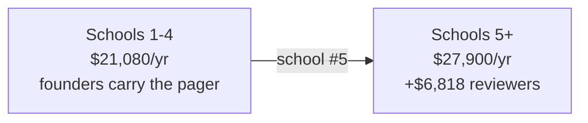

# Unit Economics and Pricing Model

> You asked me to model the price rather than pick one. Here is the model, the
> arithmetic behind it, and a recommendation.
>
> **Headline: variable cost is not the constraint, and the deck spent its entire
> economics slide on the wrong number.** At the decided architecture, gross margin never
> goes negative at any plausible usage level. What actually constrains this business is
> **how many schools two founders can sign**, and that is a pricing decision.

**FX assumption:** ₹88 = US$1. Not independently verified — treat INR figures as ±10%.

> ### ✅ `CQ-05` closed 2026-09-16 — re-priced, and one conclusion did not survive
>
> `gemini-flash-lite-latest` currently resolves to **Gemini 3.5 Flash-Lite: $0.30/1M input,
> $2.50/1M output** ([Google AI pricing](https://ai.google.dev/gemini-api/docs/pricing),
> retrieved 2026-09-16). Against the modelled $0.10/$0.40 that is **3× input and 6.25×
> output.**
>
> **What survived:** at ₹750+ variable cost is still not the constraint, and the
> school-count arithmetic still drives the pricing decision.
>
> **What did not:** this document previously asserted *"gross margin never goes negative."*
> **That is now false at ₹150/student/year under heavy engagement** — see §2. It was true
> at the modelled price and is not true at the real one. I am flagging it rather than
> quietly restating it, because it is exactly the kind of absolute that gets repeated in a
> pitch and then found by a diligence partner.
>
> **Also corrected: `CQ-06`.** `ADR-011` added a mandatory safeguarding on-call function
> this model did not carry at all. It is ~$6,800/year from school #5, and it moves the
> price recommendation. See §3.1 and §5.

---

## 1. Variable cost, bottom-up

Per tutoring session, on the architecture decided in `GD-01`/`GD-02` and PRD §6.1
(photo capture, push-to-talk, device-native speech, multimodal LLM doing OCR).

Assume a representative session: 2 photographs, 8 dialogue turns, ~500 output tokens.

| Component | Basis | Cost/session |
|---|---|---|
| LLM input (images + growing dialogue context) | ~25k tokens @ **$0.30/1M** | $0.0075 |
| LLM output | ~500 tokens @ **$2.50/1M** | $0.0013 |
| `FR-026` confirmation round-trip | Added after `PQ-01` | ~$0.0010 |
| ASR | Device-native (Web Speech API) | **$0.0000** |
| TTS | Device-native | **$0.0000** |
| OCR | Rides the multimodal LLM, not a metered service | $0.0000 |
| Image storage + egress | ~400 KB, 30-day retention | ~$0.0001 |
| Serverless compute | Per invocation | ~$0.0002 |
| **Subtotal** | | **~$0.010** |
| **Budgeted with headroom** | retries, failed OCR, long sessions | **$0.015** |

**All subsequent figures use $0.015/session — 3× the previous $0.005.**

> **The safeguarding screen is not in this table, and it must not be a second LLM call.**
> `ADR-011` runs it on **every** student turn. At ~$0.002/turn × 8 turns that is
> **$0.016/session — it would more than double session cost to catch under 1% of turns.**
>
> So the rules-first floor in `ADR-011`'s open question is not a stylistic preference, it
> is an economic requirement: **cheap deterministic rules on 100% of turns, model
> escalation only on suspicion.** `SPK-4` measures whether the rules floor holds.

### What the rejected architecture would have cost

| Architecture | Cost/session | vs $0.015 |
|---|---|---|
| **Decided** (photo, push-to-talk, native speech) | $0.015 | 1× |
| With vendor TTS (Deepgram Aura-1) | $0.045 | 3× |
| With full-duplex speech-to-speech | $0.061 | 4× |
| **With a photoreal avatar** (20 min @ $0.30/min) | **$6.015** | **400×** |

The avatar line is still the whole story. At ₹300/student/year, **a single avatar session
costs nearly twice a student's entire annual subscription.** `GD-01` was not a preference —
it was the difference between a business and an arithmetic error.

**Note the multiples compressed** (1,200× → 400×) purely because the base got more
expensive. The avatar did not get cheaper; our floor rose. Do not read the smaller multiple
as the gap closing.

---

## 2. The counterintuitive finding

Cost is driven by **active** students; revenue is driven by **enrolled** seats. So:

> Cost per enrolled student/year = WAU% × sessions/week × 30 weeks × $0.015

| Weekly active | 2 sessions/wk | 4 sessions/wk |
|---|---|---|
| 5% | $0.045 | $0.090 |
| 20% | $0.180 | $0.360 |
| 50% | $0.450 | $0.900 |
| 100% | $0.900 | **$1.800** |

Gross margin at four candidate prices:

| Price/student/yr | 5% WAU | 20% WAU | 50% WAU | 100% WAU, 4/wk |
|---|---|---|---|---|
| ₹150 ($1.70) | 97.4% | 89.4% | 73.5% | **−5.9%** |
| ₹300 ($3.41) | 98.7% | 94.7% | 86.8% | **47.2%** |
| ₹750 ($8.52) | 99.5% | 97.9% | 94.7% | **78.9%** |
| ₹1,000 ($11.36) | 99.6% | 98.4% | 96.0% | **84.2%** |

**Correction to the previous version: gross margin *can* go negative.** At ₹150/student
with every student active four times a week, inference costs **$1.80 against $1.70 of
revenue.** The old claim that it "never goes negative" was an artefact of the $0.005
assumption.

**This is an argument against discounting, not against the business.** At ₹750 the worst
case is still 78.9%. But the floor is no longer infinitely forgiving, and anyone tempted to
win a school at ₹150 should know they would be paying for that school's heaviest users.

Two consequences worth stating plainly:

1. **The deck's "98% cost advantage" was answering a question that does not matter.**
   Token pricing was never going to sink this product at this architecture. The avatar
   would have, and the cost slide never mentioned it.
2. **Low engagement is good for margin and fatal for renewal.** A school paying for 400
   seats where 15% of students engage produces excellent gross margin and does not renew.
   Optimising for margin here is optimising for failure — which is why `SM-L1` (>35% WAU)
   is a *product* target, not a finance one.

---

## 3. What actually constrains the business: fixed cost

Since variable cost is negligible, break-even is entirely about covering fixed cost.

**Year-one fixed cost, realistic and deliberately modest:**

| Item | Basis | Annual |
|---|---|---|
| Curriculum / axiom graph authoring | Maths SME, part-time 6 months @ ₹40k/mo | ~$2,700 |
| Founder subsistence (two, Hyderabad) | ₹60k/mo each | ~$16,400 |
| Entity formation + annual compliance | `FD-06` — **verified**: ₹15k once + ₹30–45k/yr | ~$700 |
| Baseline hosting, domain, tooling | | ~$400 |
| **CERT-In log retention** | 180 days, stored in India. **New — not optional** | ~$200 |
| **Lawyer opinion** | `FD-04` reopened, one-time ₹40–80k | ~$680 |
| **Subtotal, schools 1–4** | | **~$21,080** |
| **Safeguarding reviewers** | **From school #5.** 2 part-time @ ₹25k/mo (`A-028`) | **~$6,818** |
| **Total, schools 5+** | | **~$27,900** |

### 3.1 `CQ-06` — the step function the model was missing

**`ADR-011` makes safeguarding review a staffed function, not a founder side-duty.** Action
pack §3.5 models the founders' own pager as viable to ~3 schools and **breaking at ~5**.

So fixed cost is not smooth. It steps:

**Seats needed to break even:**

| Price/student/yr | Seats @ $21.1k | Schools* | Seats @ $27.9k | **Schools with reviewers*** |
|---|---|---|---|---|
| ₹150 ($1.70) | 12,400 | 50 | 16,410 | **66** |
| ₹300 ($3.41) | 6,180 | 25 | 8,180 | **33** |
| ₹750 ($8.52) | 2,474 | 10 | 3,274 | **13** |
| ₹1,000 ($11.36) | 1,855 | 8 | 2,456 | **10** |

\* ~250 students across Grades 10–12 in a mid-size private school. Note this is *not* total
enrolment — a 1,200-student school has roughly 250 in the target grades, which is the
number that matters and is easy to get wrong.

**Read the last column, not the fourth.** You cannot reach 13 schools without passing
school #5, so the reviewer cost is unavoidable on any path to break-even. **The
safeguarding function adds ~3 schools to break-even at ₹750.**

Put another way: at ₹750 a school brings $2,130/year, so **the reviewer hire consumes
3.2 schools of revenue.** Schools 5, 6 and 7 exist to pay for safeguarding.

**`SPK-4` has a dollar value.** The cliff is set by detector false-positive rate, not by
disclosure prevalence. Halving false positives roughly doubles the schools two founders can
cover — **pushing the hire from school #5 to school #10, worth ~$6,800/year deferred.** That
is why detector precision is a commercial metric and not merely a quality one.

**This table is the actual pricing decision.** 66 schools is not a thing two founders sign
in year one. 10–13 is, given existing family relationships. The price has to be set by the
sales motion you can execute, not by what feels affordable.

---

## 4. Is a higher price defensible?

| Benchmark | Per student/yr | Note |
|---|---|---|
| Mid-market Indian school ERP | ~₹66 ($0.75) | ₹9–20k/yr for a whole 304-student school |
| Enterprise tier (TCS iON class) | ₹1,440–3,000 | **Includes full ERP + devices** |
| Proposed deck price | ₹2,640–4,400 | 11–18% of annual tuition — not viable |
| **Photomath Plus, paid by parents** | **₹6,160** | $69.99/yr |
| **Gauth Plus, paid by parents** | **₹8,800** | $99.99/yr |
| Urban private school tuition | ₹31,782 | The ceiling everything sits inside |

Two things jump out.

**₹600–750 sits in a genuine gap.** It is well above the ERP commodity rate, well below
the enterprise bundle, and it buys a focused product for the two grades where the school's
reputation is actually made. At ₹750 it is **2.4% of annual tuition**.

**Parents already pay 8–12× more than this for strictly worse tools.** A parent spending
₹6,160/year on Photomath is buying an answer machine. That is not an argument for B2C —
`O-05` closed that, and DPDP makes it worse — but it is an argument that the willingness
to pay exists and is currently pointed at the wrong product.

### The structure that threads the needle

**School-collected parent contribution.** The school adds ₹750/student to its fee
schedule and contracts with us as the customer. The school remains the Data Fiduciary,
so the Fourth Schedule educational-institution exemption still applies (`GD-07`), and we
remain its processor — while the money comes from the parent budget that is demonstrably
already there.

This is a commercial structure, not a legal opinion. It needs review before it is
offered to a school, and it should not appear in any pitch until it has been.

---

## 5. Recommendation

> **Revised 2026-09-16: ₹1,000 per student per year (~$11.36)**, Grades 10–12 maths,
> school-contracted, parent-funded through the school's fee schedule.

**Previously ₹750. The change is not a re-think — it is new cost.** `ADR-011` added a
~$6,800/year safeguarding function that did not exist when ₹750 was derived, and the
verified token price is 3× the modelled one. Holding ₹750 would push break-even to **13
schools**; ₹1,000 brings it back to **10**, inside the 7–12 band the original analysis
established as signable by two founders.

| | ₹750 | **₹1,000** |
|---|---|---|
| Break-even (with reviewers) | 13 schools | **10 schools** |
| Gross margin at 50% WAU | 94.7% | **96.0%** |
| Gross margin at 100% WAU, 4/wk | 78.9% | **84.2%** |
| Share of annual tuition | 2.4% | **3.1%** |
| vs what parents already pay Photomath | 12% | **16%** |

**Why this is defensible rather than opportunistic:** ₹1,000 is still **3.1% of annual
tuition** and still **one-sixth** of what a parent already pays Photomath for an answer
machine. And the thing the extra ₹250 buys is real and nameable — **a staffed safeguarding
function no Indian edtech currently publishes** (action pack §3.7). It is the rare case
where the cost driver is also the differentiator, and it should be sold that way rather than
buried in a line item.

**Pilot pricing: free for the first three schools**, in exchange for the baseline
diagnostic (`FR-017`), termly outcome measurement, and a reference. The evidence asset is
worth more than three schools of revenue, and free removes the procurement cycle from the
critical path entirely.

**Do not discount below ₹500.** Below that the school count needed for break-even exceeds
what two founders can sign, and a low anchor is very hard to raise later in a market where
the buyer talks to other schools.

---

## 6. What would break this model

| Assumption | Breaks if | Consequence |
|---|---|---|
| ~$0.015/session | `PQ-01` fails and OCR needs a metered service (Mathpix) or multiple retries per turn | Costs rise 3–10×. Still profitable at ₹1,000, but the cushion goes |
| Device-native speech is acceptable | `PQ-03` shows students reject robotic TTS | Vendor TTS adds $0.030/session ≈ 3× cost. Still >70% margin at ₹1,000, but it changes the LLM budget |
| **The safeguarding screen stays rules-first** | It becomes a per-turn LLM call | **Session cost more than doubles** (§1). This is a design constraint, not a preference |
| **Reviewers cost ₹25k/mo part-time** (`A-028`) | Trained counsellors cost 2× that in Hyderabad | Break-even at ₹1,000 moves from 10 schools to ~13. **`CQ-07` — ask one counsellor** |
| ~250 students in Grades 10–12 per school | Schools are smaller than assumed | Schools-needed roughly doubles at 125/school. **Verify against a real school before committing to a price** |
| Schools will pay for a point solution | They only buy bundles | Whole GTM changes; partner or be a feature |
| Founders on ₹60k/month | Anyone needs market salary | Fixed cost roughly triples; break-even goes to ~25 schools |
| 30 teaching weeks | Board-exam years compress usage into fewer, heavier weeks | Margin improves, engagement metrics get seasonal — do not read a January dip as churn |

---

## 7. Open

> **On `CQ-01` — not a blocker.** The founders' position is that school size varies too
> much to fix this early, and that is right. The model does not need a single number; it
> needs a range, and the recommendation survives across it:
>
> | Grades 10–12 per school | Schools needed at ₹750 |
> |---|---|
> | 125 (small school) | 19 |
> | 250 (assumed) | 9 |
> | 400 (chain campus) | 6 |
>
> Even at the pessimistic end, ₹750 needs **19 schools** where ₹300 would need **47**.
> The ordering does not change, so the price decision holds without pinning the number.
> Refine it opportunistically as real schools come into view.

| ID | Question | Owner |
|---|---|---|
| **CQ-01** | Typical Grades 10–12 cohort size — refine the range above as real schools appear. Not blocking | CEO, opportunistic |
| **CQ-02** | Will a school add a line to its fee schedule for a third-party tool, or must it come from an existing budget? Determines whether §4's structure exists | CEO |
| **CQ-03** | Does the school-collected parent contribution hold up under DPDP as described? **Fold into lawyer Q2** | Needs review before it is offered |
| ~~**CQ-04**~~ | ~~Real `$/session`~~ | ✅ Closed — $0.015 modelled on verified pricing |
| ~~**CQ-05**~~ | ~~Re-price against `flash-lite-latest`~~ | ✅ **Closed 2026-09-16.** $0.30/$2.50 verified |
| ~~**CQ-06**~~ | ~~Safeguarding on-call cost missing~~ | ✅ **Closed 2026-09-16.** §3.1 |
| **CQ-07** | **What does a trained part-time safeguarding reviewer actually cost in Hyderabad?** `A-028` is modelled, not quoted | CEO — ask one counsellor |
| **CQ-08** | Re-check token pricing **before 1 Jan 2027** — Gemini Flash tiers have announced increases effective that date | CTO |

---

## Changelog

| Version | Date | Author | Change |
|---------|------|--------|--------|
| 0.1.0 | 2026-09-08 | CTO (incoming) | Bottom-up model. Finds variable cost is not the constraint; recommends ₹750/student/year on a school-count basis. |
| 0.2.0 | 2026-09-16 | CTO (incoming) | **`CQ-05` and `CQ-06` closed.** Re-priced on verified Gemini 3.5 Flash-Lite ($0.30/$2.50) — session cost 3× to $0.015, and **"margin never goes negative" is withdrawn**: ₹150 is −5.9% at heavy usage. Adds the `ADR-011` safeguarding step function (~$6,800/yr from school #5), CERT-In log retention, and the lawyer opinion. **Price recommendation revised ₹750 → ₹1,000** to hold break-even at 10 schools. Adds `A-028`, `CQ-07`, `CQ-08`. |

## Related documents

- [`../00-context/03-gate-decisions.md`](../00-context/03-gate-decisions.md) — `GD-12`
- [`../02-prd/00-prd.md`](../02-prd/00-prd.md) §6.1 — the cost ceiling this replaces with a real model
